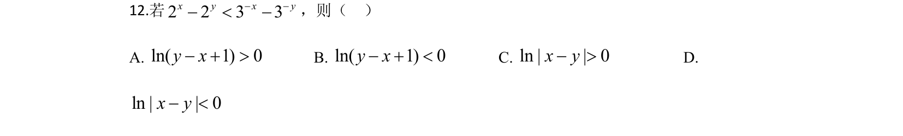
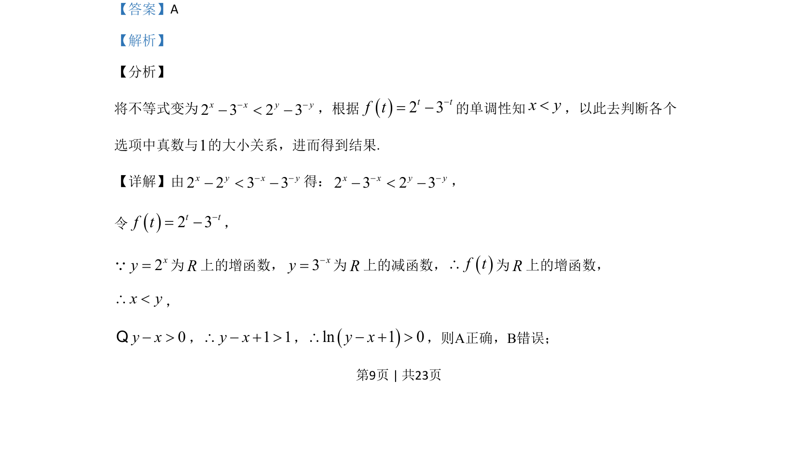
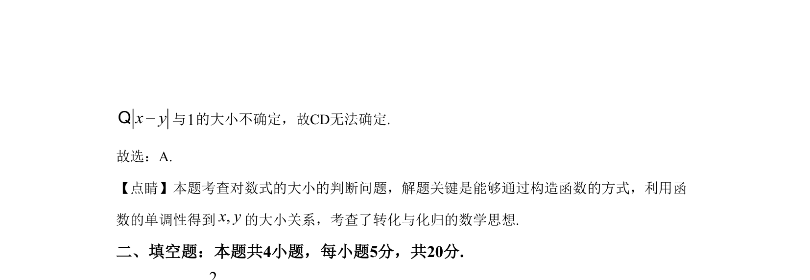

## 题面

## 摘要

通过构造函数并利用单调性比较两数大小，进而判断对数式的正负。

## 关联考点

- [[432-导数与函数单调性|函数单调性]]
- [[298-对数函数|对数函数]]
- [[构造函数]]
- [[不等式比较]]

## 答案与解析

> 📄 原 PDF 第 9 页：`素材/真题/吉林/2008-2024·（吉林）数学高考真题/2020年高考数学试卷（文）（新课标Ⅱ）（解析卷）.pdf`
