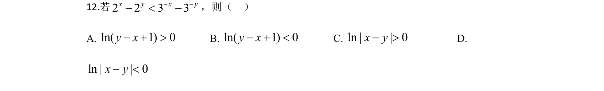
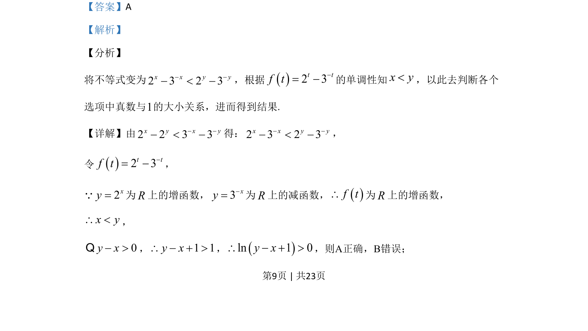
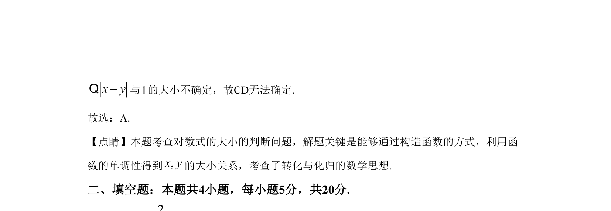

## 题面

## 摘要

通过构造函数并利用单调性比较两数大小，进而判断对数式的正负。

## 关联考点

- [[432-导数与函数单调性|函数单调性]]
- [[298-对数函数|对数函数]]
- [[923-构造函数|构造函数]]
- [[622-不等式比较|不等式比较]]

## 答案与解析

> 📄 原 PDF 第 9 页：`素材/真题/吉林/2008-2024·（吉林）数学高考真题/2020年高考数学试卷（文）（新课标Ⅱ）（解析卷）.pdf`

<!-- 题干文本-start -->
## 题干文本
12.若2 2 3 3x y x y- -- < -，则（    ）
A. ln( 1) 0y x- + >B. ln( 1) 0y x- + <C. ln | | 0x y- >D. 
ln | | 0x y- <
<!-- 题干文本-end -->

<!-- 解析文本-start -->
## 解析文本
【答案】A
【解析】
【分析】
将不等式变为2 3 2 3x x y y- -- < -，根据()2 3t tf t-= -的单调性知x y<，以此去判断各个
选项中真数与1的大小关系，进而得到结果.
【详解】由2 2 3 3x y x y- -- < -得：2 3 2 3x x y y- -- < -，
令()2 3t tf t-= -，
2xy=Q为R上的增函数，3xy-=为R上的减函数，()f t\为R上的增函数，
x y\ <，
0y x- >Q，1 1y x\ - + >，()ln 1 0y x\ - + >，则A正确，B错误；
<!-- 解析文本-end -->
