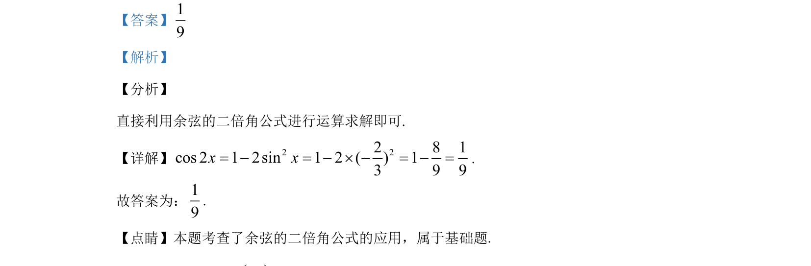

## 题面

## 摘要

本题考查余弦的二倍角公式的直接应用，通过代入已知数值求解。

## 关联考点

- [[655-余弦的二倍角公式|余弦的二倍角公式]]

## 答案与解析

> 📄 原 PDF 第 10 页：`素材/真题/吉林/2008-2024·（吉林）数学高考真题/2020年高考数学试卷（文）（新课标Ⅱ）（解析卷）.pdf`

<!-- 题干文本-start -->
## 题干文本
13.若2sin3x= -，则cos 2x=__________．
<!-- 题干文本-end -->

<!-- 解析文本-start -->
## 解析文本
【答案】19
【解析】
【分析】
直接利用余弦的二倍角公式进行运算求解即可.
【详解】 2 22 8 1cos 2 1 2sin 1 2 ( ) 13 9 9x x= - = - ´ - = - =.
故答案为：19
.
【点睛】本题考查了余弦的二倍角公式的应用，属于基础题.
<!-- 解析文本-end -->
