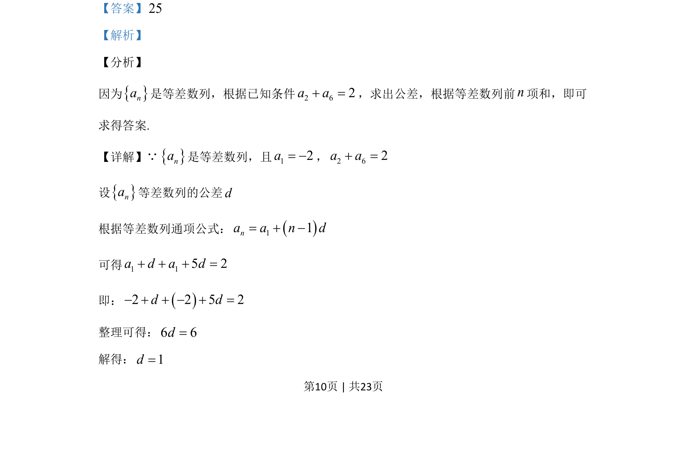
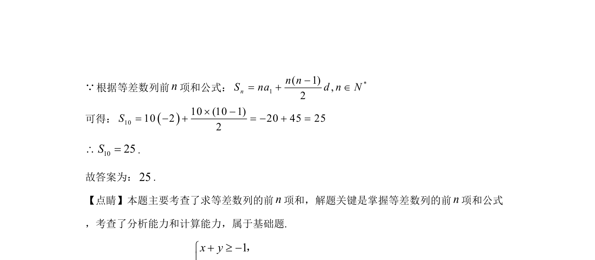

## 题面

## 摘要

该题考查等差数列通项公式与前n项和公式的应用，通过已知条件求公差并计算前10项和。

## 关联考点

- [[1063-等差数列通项公式|等差数列通项公式]]
- [[1181-等差数列前n项和公式|等差数列前n项和公式]]
- [[061-方程|方程求解]]

## 答案与解析

> 📄 原 PDF 第 10 页：`素材/真题/吉林/2008-2024·（吉林）数学高考真题/2020年高考数学试卷（文）（新课标Ⅱ）（解析卷）.pdf`
