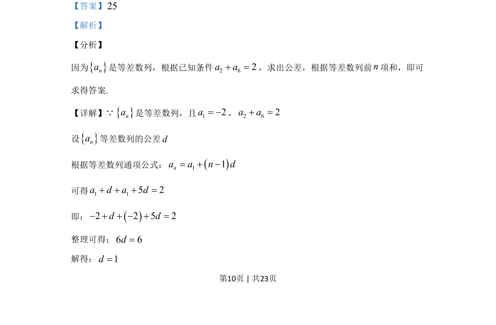
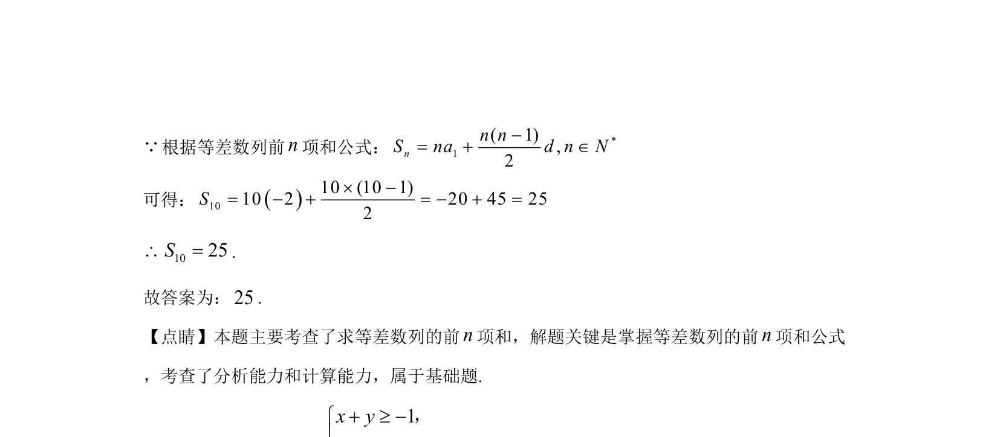

## 题面

## 摘要

该题考查等差数列通项公式与前n项和公式的应用，通过已知条件求公差并计算前10项和。

## 关联考点

- [[1063-等差数列通项公式|等差数列通项公式]]
- [[1181-等差数列前n项和公式|等差数列前n项和公式]]
- [[061-方程|方程求解]]

## 答案与解析

> 📄 原 PDF 第 10 页：`素材/真题/吉林/2008-2024·（吉林）数学高考真题/2020年高考数学试卷（文）（新课标Ⅱ）（解析卷）.pdf`

<!-- 题干文本-start -->
## 题干文本
14.记nS为等差数列{}na的前n项和．若1 2 62, 2a a a= - + =，则10S=__________．
<!-- 题干文本-end -->

<!-- 解析文本-start -->
## 解析文本
【答案】25
【解析】
【分析】
因为{}na是等差数列，根据已知条件2 62a a+ =，求出公差，根据等差数列前n项和，即可
求得答案.
【详解】Q{}na是等差数列，且12a= -，2 62a a+ =
设{}na等差数列的公差d
根据等差数列通项公式：()11na a n d+ -=
可得1 15 2a d a d+ + + =
即：()2 2 5 2d d- + + - + =
整理可得：6 6d=
解得：1d=
<!-- 解析文本-end -->
