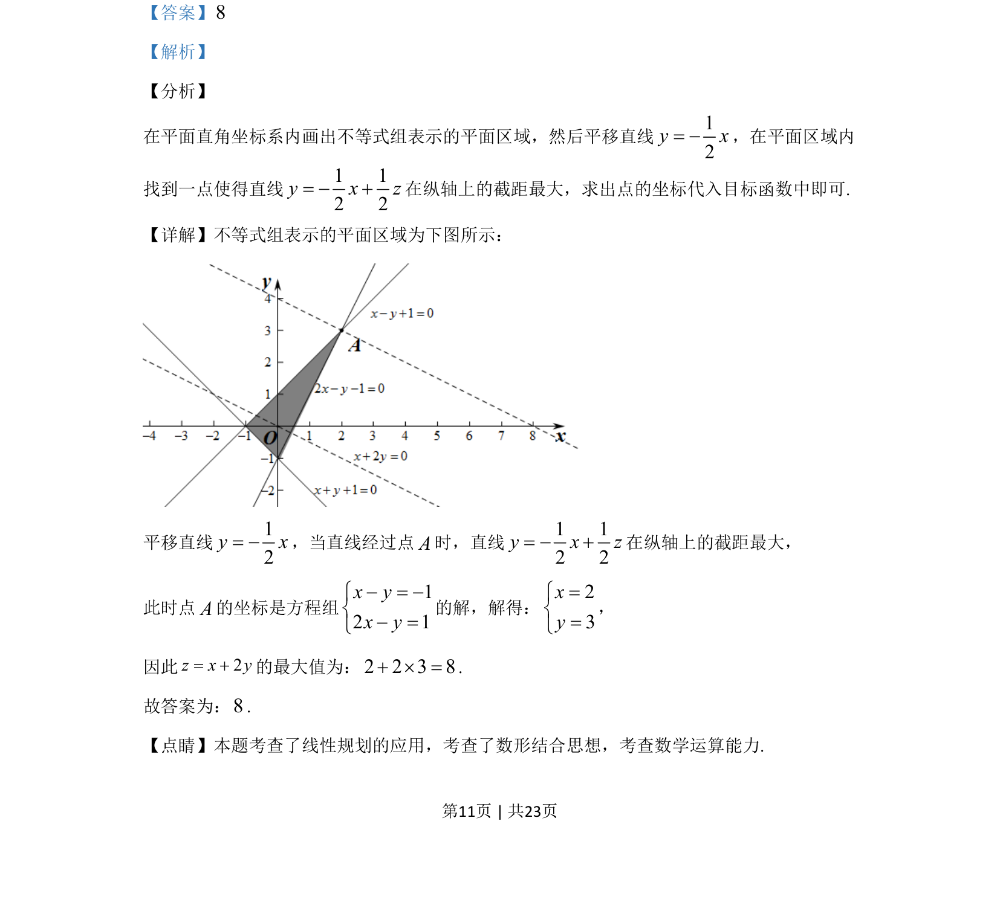

## 题面

## 摘要

本题通过画出不等式组表示的平面区域，结合目标函数的几何意义求线性目标函数的最大值。

## 关联考点

- [[1074-简单线性规划|线性规划]]
- [[897-数形结合|数形结合]]
- [[896-数学运算|数学运算]]

## 答案与解析

> 📄 原 PDF 第 11 页：`素材/真题/吉林/2008-2024·（吉林）数学高考真题/2020年高考数学试卷（文）（新课标Ⅱ）（解析卷）.pdf`

<!-- 题干文本-start -->
## 题干文本
15.若x，y满足约束条件
112 1,x yx yx y+ ³ -ìï- ³ -íï- £î，，则2z x y= +的最大值是__________．
<!-- 题干文本-end -->

<!-- 解析文本-start -->
## 解析文本
【答案】8
【解析】
【分析】
在平面直角坐标系内画出不等式组表示的平面区域，然后平移直线12y x= -，在平面区域内
找到一点使得直线1 12 2y x z= - +在纵轴上的截距最大，求出点的坐标代入目标函数中即可.
【详解】不等式组表示的平面区域为下图所示：
平移直线12y x= -，当直线经过点A时，直线1 12 2y x z= - +在纵轴上的截距最大，
此时点A的坐标是方程组
12 1x yx y- = -ìí- =î
的解，解得：
23xy=ìí=î
，
因此2z x y= +的最大值为：2 2 3 8+ ´ =.
故答案为：8.
【点睛】本题考查了线性规划的应用，考查了数形结合思想，考查数学运算能力.
<!-- 解析文本-end -->
