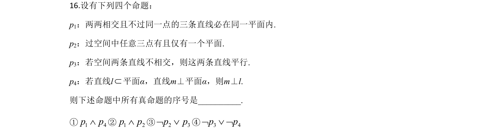
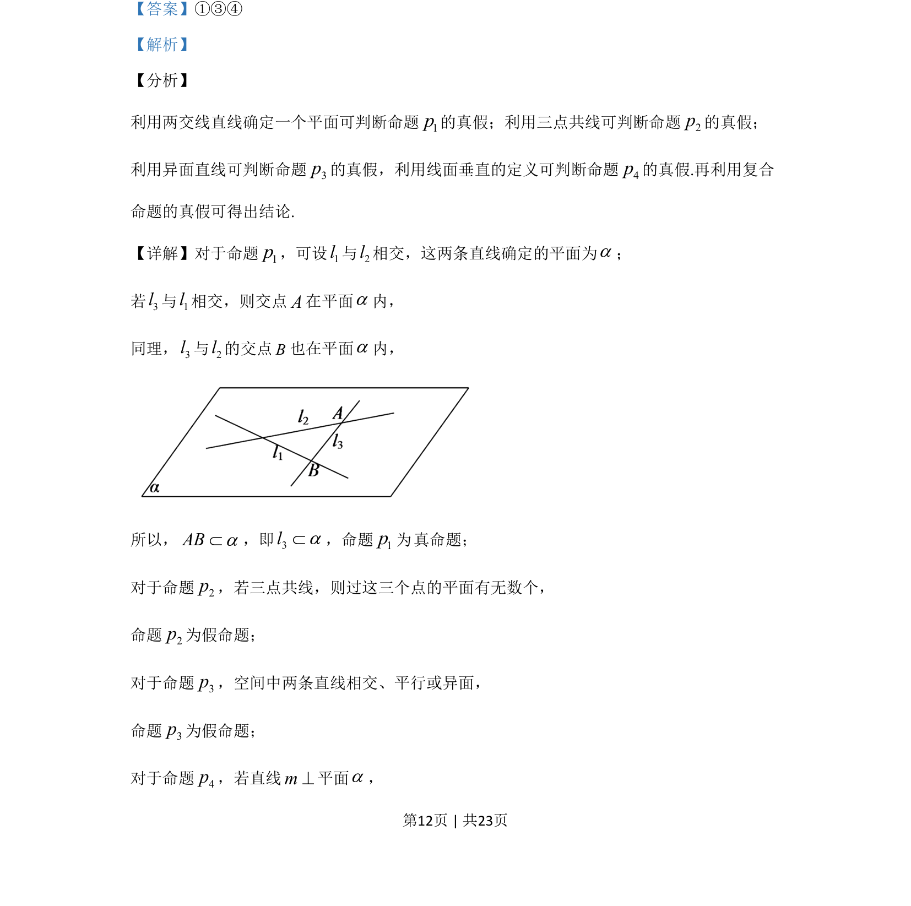
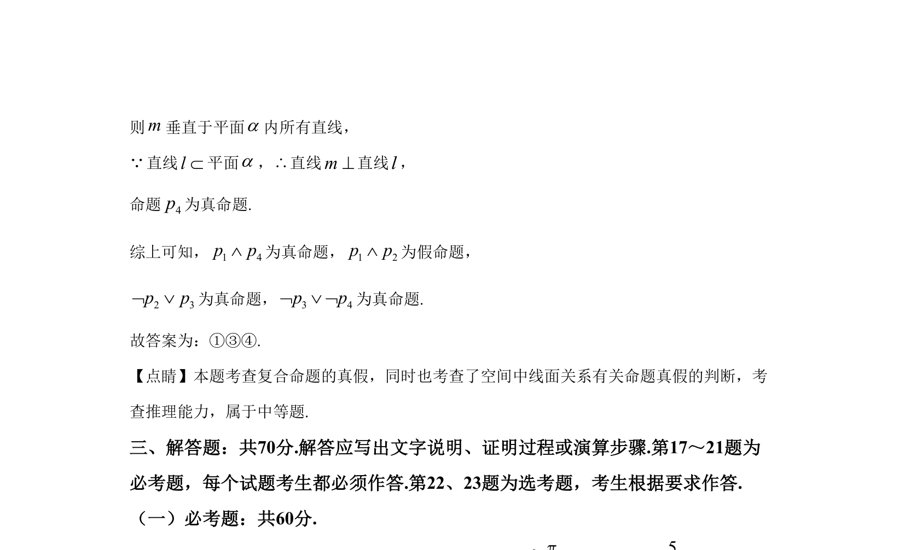

## 题面

## 摘要

考查空间中线面位置关系命题的真假判断及复合命题真假判定。

## 关联考点

- [[1201-空间线面关系|空间线面关系]]
- [[765-命题真假判断|命题真假判断]]
- [[797-复合命题|复合命题]]

## 答案与解析

> 📄 原 PDF 第 12 页：`素材/真题/吉林/2008-2024·（吉林）数学高考真题/2020年高考数学试卷（文）（新课标Ⅱ）（解析卷）.pdf`

<!-- 题干文本-start -->
## 题干文本
16.设有下列四个命题：
p1：两两相交且不过同一点的三条直线必在同一平面内.
p2：过空间中任意三点有且仅有一个平面.
p3：若空间两条直线不相交，则这两条直线平行.
p4：若直线lÌ平面α，直线m⊥平面α，则m⊥l.
则下述命题中所有真命题的序号是__________.
①1 4p pÙ②1 2p pÙ③2 3p pØ Ú④3 4p pØ Ú Ø
<!-- 题干文本-end -->

<!-- 解析文本-start -->
## 解析文本
【答案】①③④
【解析】
【分析】
利用两交线直线确定一个平面可判断命题1p的真假；利用三点共线可判断命题2p的真假；
利用异面直线可判断命题3p的真假，利用线面垂直的定义可判断命题4p的真假.再利用复合
命题的真假可得出结论.
【详解】对于命题1p，可设1l与2l相交，这两条直线确定的平面为a；
若3l与1l相交，则交点A在平面a内，
同理，3l与2l的交点B也在平面a内，
所以，ABaÌ，即3laÌ，命题1p真命题；
对于命题2p，若三点共线，则过这三个点的平面有无数个，
命题2p为假命题；
对于命题3p，空间中两条直线相交、平行或异面，
命题3p为假命题；
对于命题4p，若直线m^平面a，
为
<!-- 解析文本-end -->
