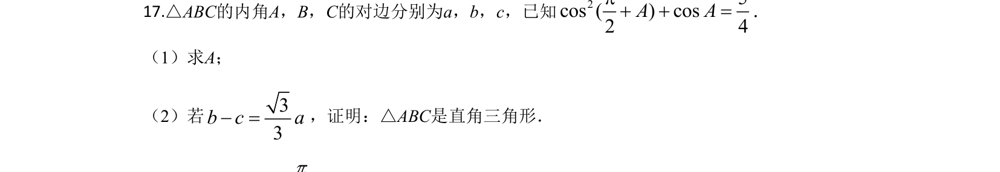
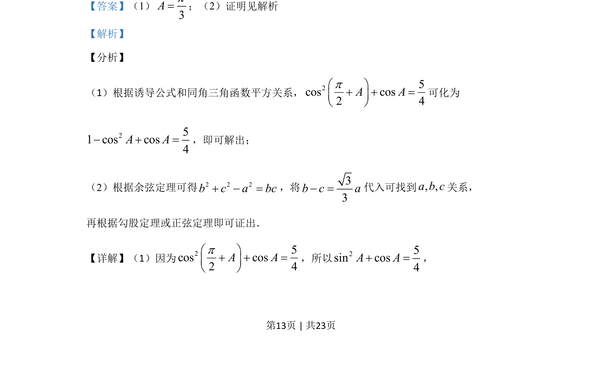
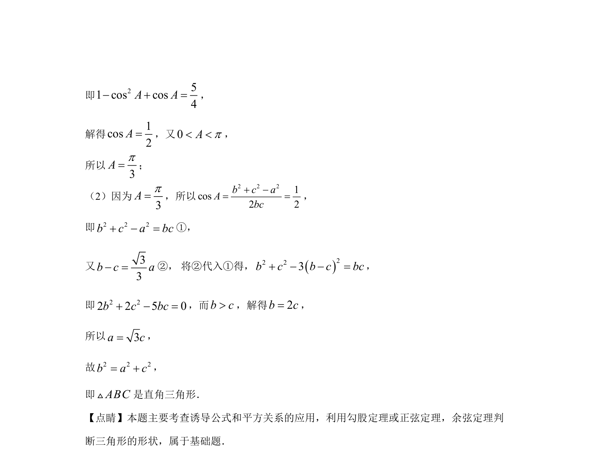

## 题面

## 摘要

利用诱导公式与同角关系求角A，再结合余弦定理和边的关系证明结论。

## 关联考点

- [[312-诱导公式|诱导公式]]
- [[1156-平方关系|同角三角函数平方关系]]
- [[126-定理|余弦定理]]

## 答案与解析

> 📄 原 PDF 第 13 页：`素材/真题/吉林/2008-2024·（吉林）数学高考真题/2020年高考数学试卷（文）（新课标Ⅱ）（解析卷）.pdf`
