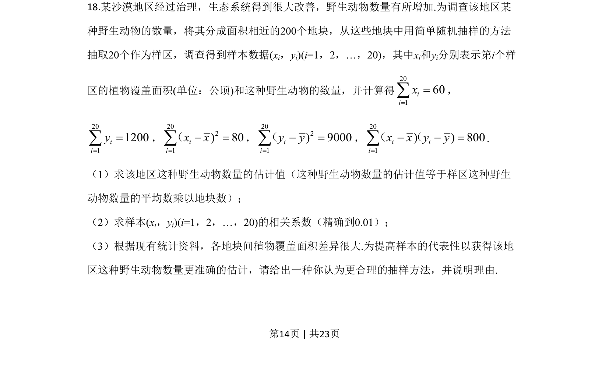
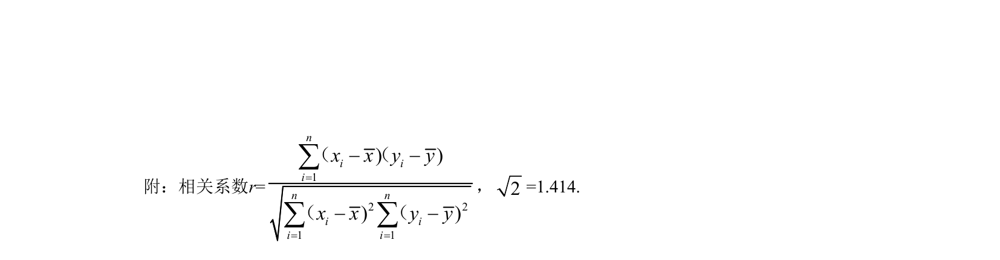
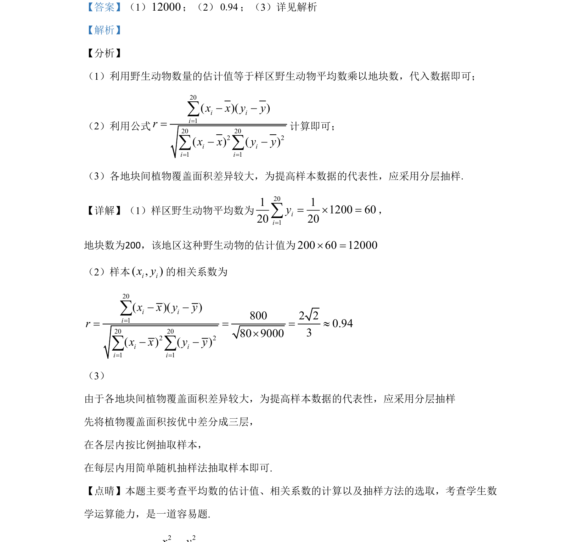

## 题面

## 摘要

该题考查用样本平均数估计总体、计算相关系数及选择合适的抽样方法以改进估计精度。

## 关联考点

- [[929-样本估计总体|样本估计总体]]
- [[359-统计案例|相关系数]]
- [[881-抽样方法|抽样方法]]

## 答案与解析

> 📄 原 PDF 第 14 页：`素材/真题/吉林/2008-2024·（吉林）数学高考真题/2020年高考数学试卷（文）（新课标Ⅱ）（解析卷）.pdf`
