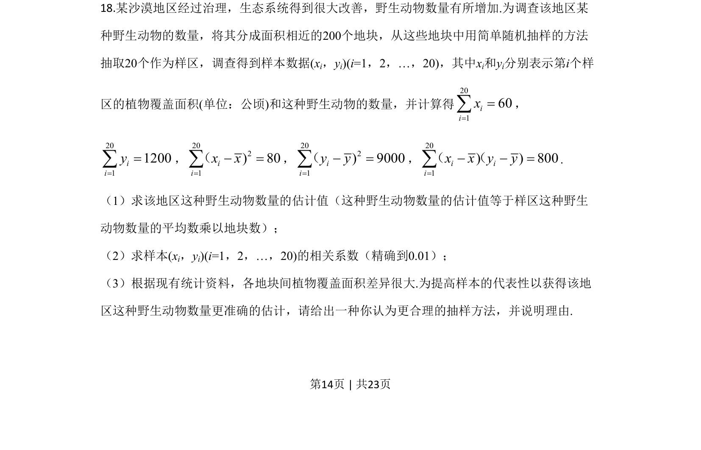
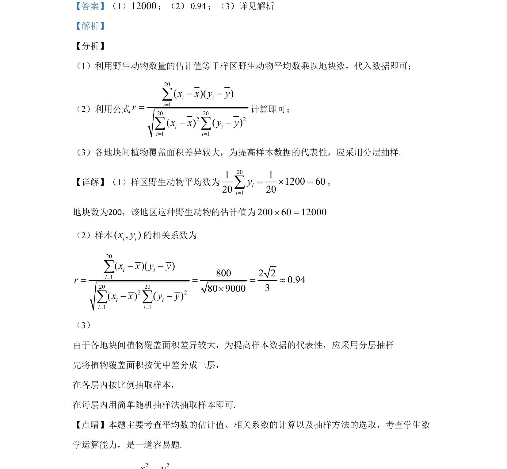

## 题面

## 摘要

该题考查用样本平均数估计总体、计算相关系数及选择合适的抽样方法以改进估计精度。

## 关联考点

- [[929-样本估计总体|样本估计总体]]
- [[359-统计案例|相关系数]]
- [[881-抽样方法|抽样方法]]

## 答案与解析

> 📄 原 PDF 第 14 页：`素材/真题/吉林/2008-2024·（吉林）数学高考真题/2020年高考数学试卷（文）（新课标Ⅱ）（解析卷）.pdf`

<!-- 题干文本-start -->
## 题干文本
18.某沙漠地区经过治理，生态系统得到很大改善，野生动物数量有所增加.为调查该地区某
种野生动物的数量，将其分成面积相近的200个地块，从这些地块中用简单随机抽样的方法
抽取20个作为样区，调查得到样本数据(xi，yi)(i=1，2，…，20)，其中xi和yi分别表示第i个样
区的植物覆盖面积(单位：公顷)和这种野生动物的数量，并计算得
20160iix==å，
2011200iiy==å，
2021) 80iixx=- =å（，
2021) 9000iiyy=- =å（，
201) ) 800iiix yx y=- - =å（（.
（1）求该地区这种野生动物数量的估计值（这种野生动物数量的估计值等于样区这种野生
动物数量的平均数乘以地块数）；
（2）求样本(xi，yi)(i=1，2，…，20)的相关系数（精确到0.01）；
（3）根据现有统计资料，各地块间植物覆盖面积差异很大.为提高样本的代表性以获得该地
区这种野生动物数量更准确的估计，请给出一种你认为更合理的抽样方法，并说明理由.
<!-- 题干文本-end -->

<!-- 解析文本-start -->
## 解析文本

<!-- 解析文本-end -->
