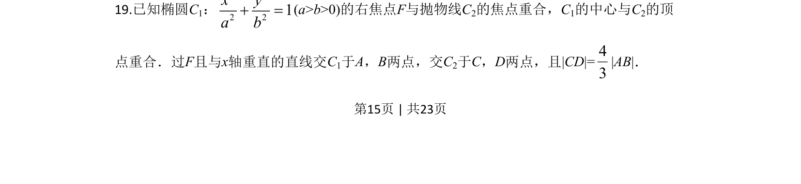
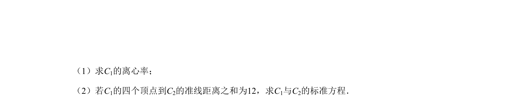
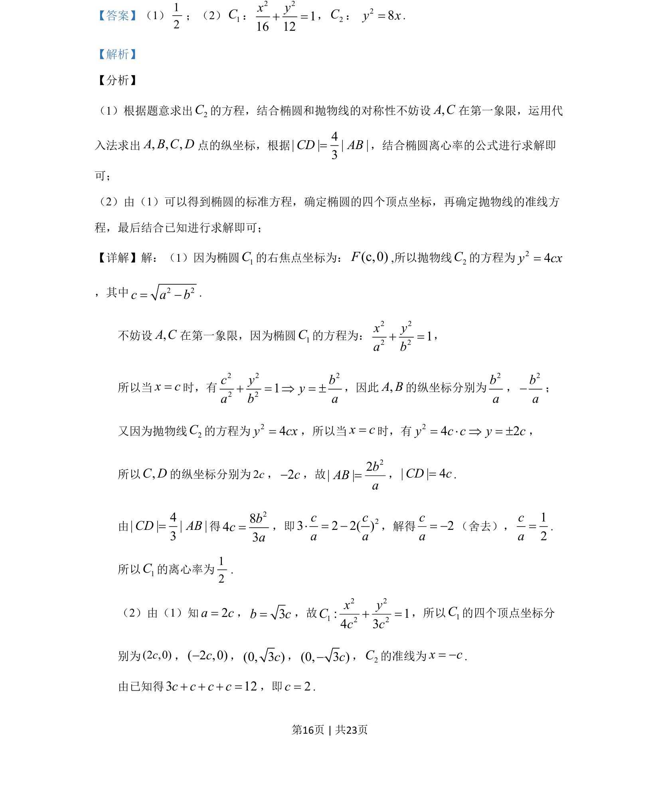
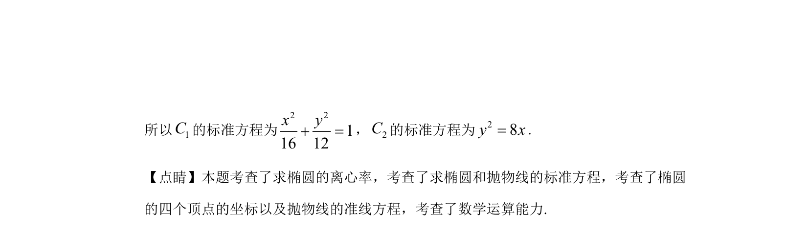

## 题面

## 摘要

本题考查椭圆与抛物线的标准方程及几何性质，利用交点坐标求弦长并计算离心率。

## 关联考点

- [[椭圆标准方程]]
- [[抛物线标准方程]]
- [[弦长]]
- [[391-椭圆离心率|离心率]]

## 答案与解析

> 📄 原 PDF 第 15 页：`素材/真题/吉林/2008-2024·（吉林）数学高考真题/2020年高考数学试卷（文）（新课标Ⅱ）（解析卷）.pdf`
