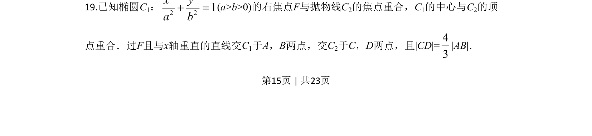
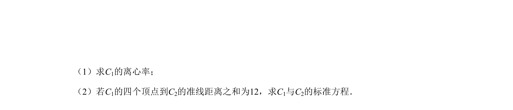
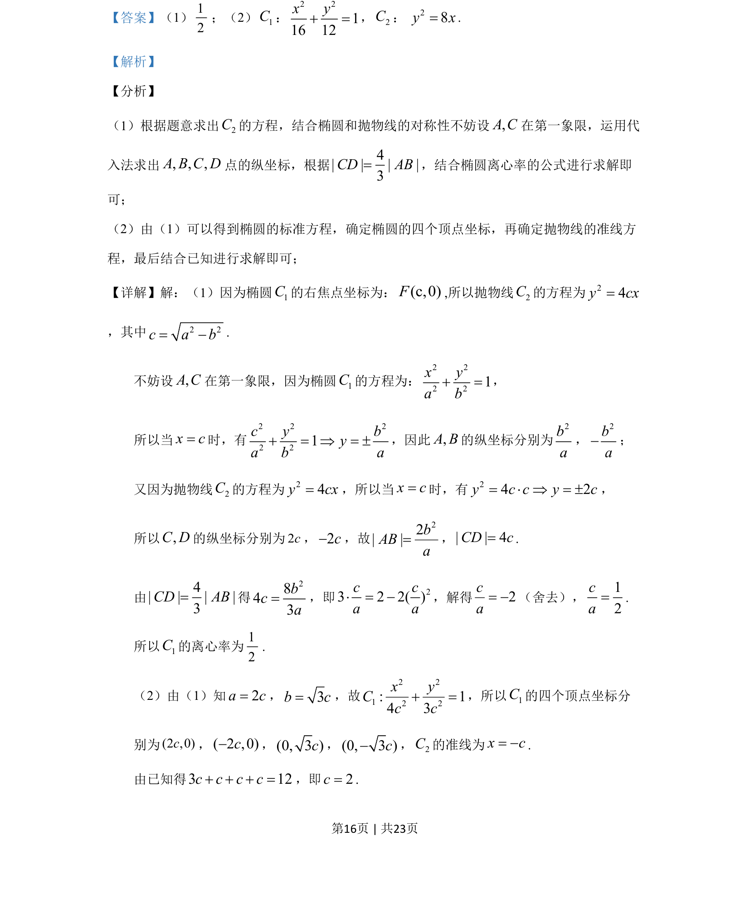
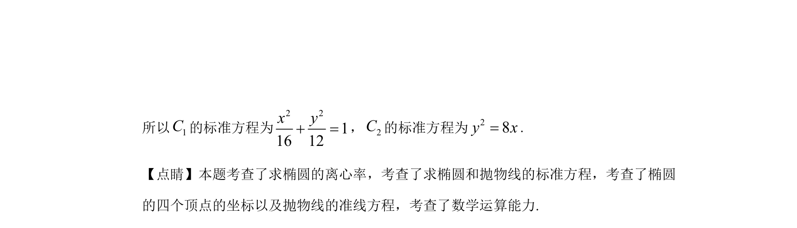

## 题面

## 摘要

本题考查椭圆与抛物线的标准方程及几何性质，利用交点坐标求弦长并计算离心率。

## 关联考点

- [[941-椭圆标准方程|椭圆标准方程]]
- [[1166-抛物线标准方程|抛物线标准方程]]
- [[866-弦长|弦长]]
- [[391-椭圆离心率|离心率]]

## 答案与解析

> 📄 原 PDF 第 15 页：`素材/真题/吉林/2008-2024·（吉林）数学高考真题/2020年高考数学试卷（文）（新课标Ⅱ）（解析卷）.pdf`

<!-- 题干文本-start -->
## 题干文本
19.已知椭圆C1：
2 22 21x ya b+ =(a>b>0)的右焦点F与抛物线C2的焦点重合，C1的中心与C2的顶
点重合．过F且与x轴重直的直线交C1于A，B两点，交C2于C，D两点，且|CD|=43
|AB|．
<!-- 题干文本-end -->

<!-- 解析文本-start -->
## 解析文本

<!-- 解析文本-end -->
