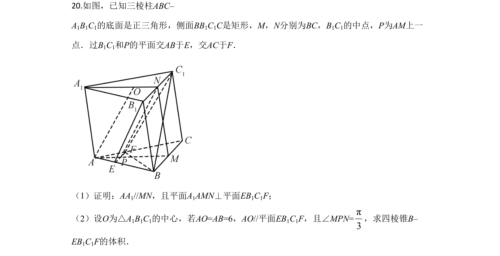
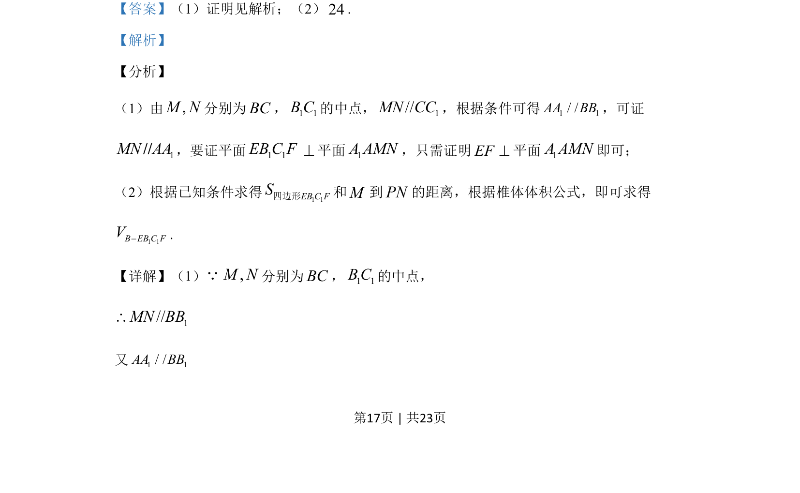
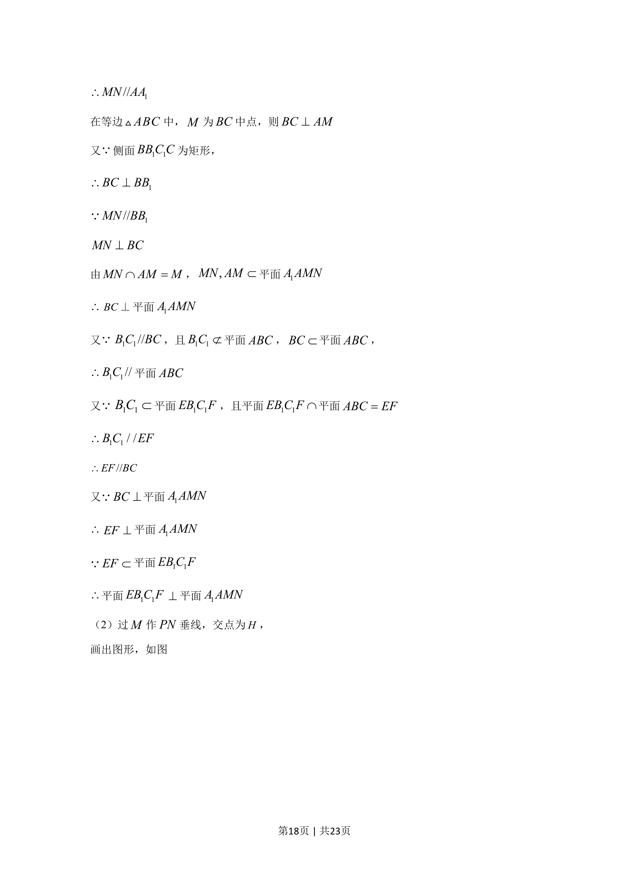
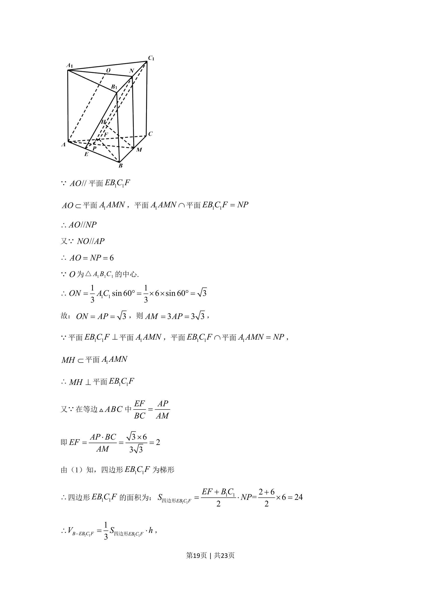
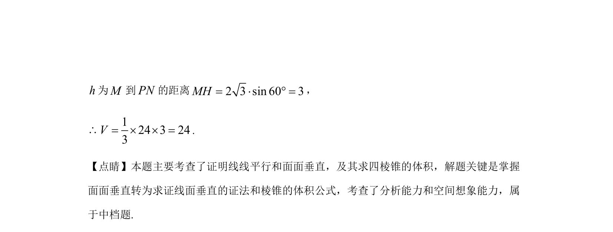

## 题面

## 摘要

该题考查线面平行与垂直的证明以及利用体积公式求几何体体积。

## 关联考点

- [[352-空间直线平面平行|线面平行]]
- [[351-空间直线平面垂直|线面垂直]]
- [[体积计算]]

## 答案与解析

> 📄 原 PDF 第 17 页：`素材/真题/吉林/2008-2024·（吉林）数学高考真题/2020年高考数学试卷（文）（新课标Ⅱ）（解析卷）.pdf`
