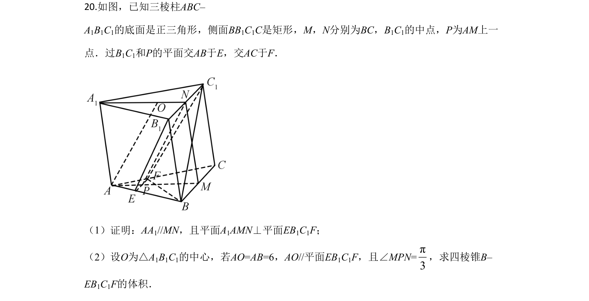
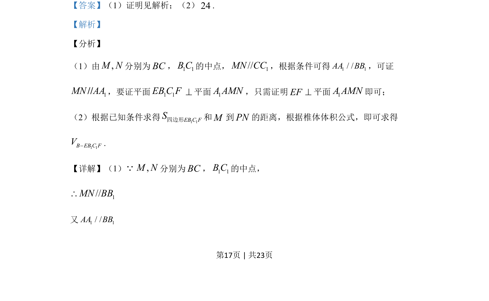
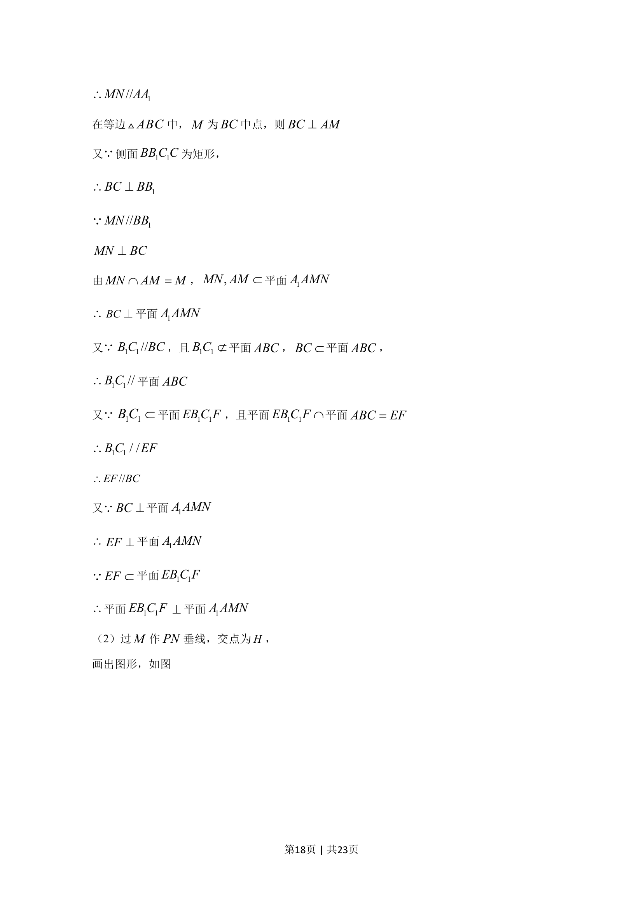
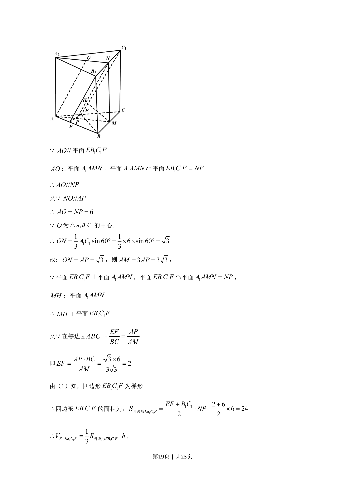
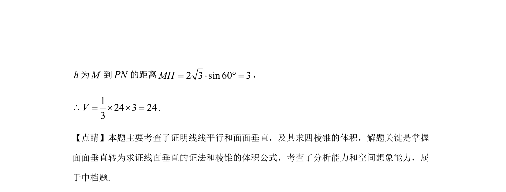

## 题面

## 摘要

该题考查线面平行与垂直的证明以及利用体积公式求几何体体积。

## 关联考点

- [[352-空间直线平面平行|线面平行]]
- [[351-空间直线平面垂直|线面垂直]]
- [[652-体积计算|体积计算]]

## 答案与解析

> 📄 原 PDF 第 17 页：`素材/真题/吉林/2008-2024·（吉林）数学高考真题/2020年高考数学试卷（文）（新课标Ⅱ）（解析卷）.pdf`

<!-- 题干文本-start -->
## 题干文本
20.如图，已知三棱柱ABC–
A1B1C1的底面是正三角形，侧面BB1C1C是矩形，M，N分别为BC，B1C1的中点，P为AM上一
点．过B1C1和P的平面交AB于E，交AC于F．
（1）证明：AA1//MN，且平面A1AMN⊥平面EB1C1F；
（2）设O为△A1B1C1的中心，若AO=AB=6，AO//平面EB1C1F，且∠MPN=π3
，求四棱锥B–
EB1C1F的体积．
<!-- 题干文本-end -->

<!-- 解析文本-start -->
## 解析文本
【答案】（1）证明见解析；（2）24.
【解析】
【分析】
（1）由,M N分别为BC，1 1B C的中点， 1//MN CC，根据条件可得1 1/ /AA BB，可证
1MN AA//，要证平面1 1EB C F^平面1A AMN，只需证明EF^平面1A AMN即可；
（2）根据已知条件求得 1 1EB C FS四边形和M到PN的距离，根据椎体体积公式，即可求得
1 1B EB C FV-.
【详解】（1）Q,M N分别为BC，1 1B C的中点，
1//MNBB\
又1 1/ /AA BB
<!-- 解析文本-end -->
