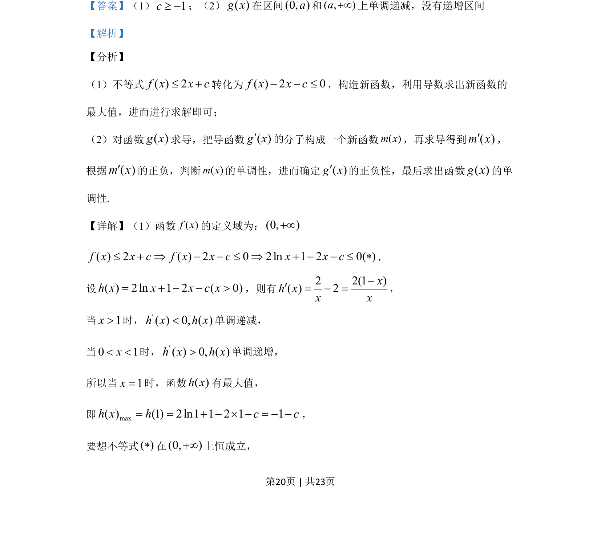
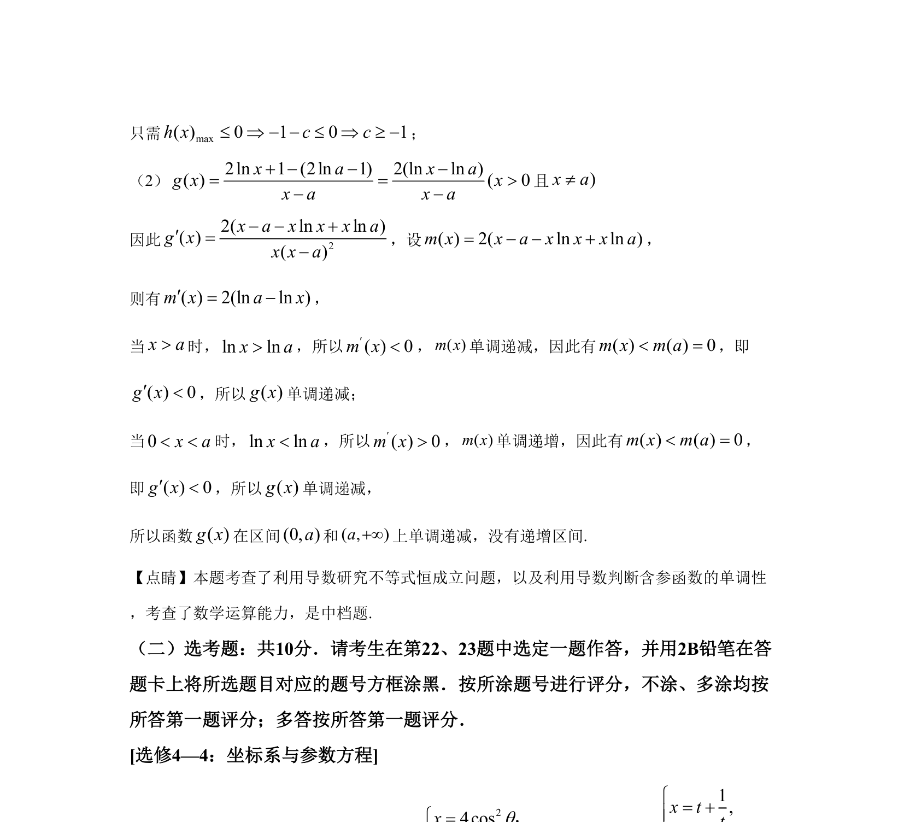

## 题面

## 摘要

本题考查利用导数解决不等式恒成立问题及含参函数单调性判定。

## 关联考点

- [[705-利用导数研究函数的单调性|导数与单调性]]
- [[839-导数与最值|导数与最值]]
- [[531-不等式恒成立|不等式恒成立]]

## 答案与解析

> 📄 原 PDF 第 20 页：`素材/真题/吉林/2008-2024·（吉林）数学高考真题/2020年高考数学试卷（文）（新课标Ⅱ）（解析卷）.pdf`
