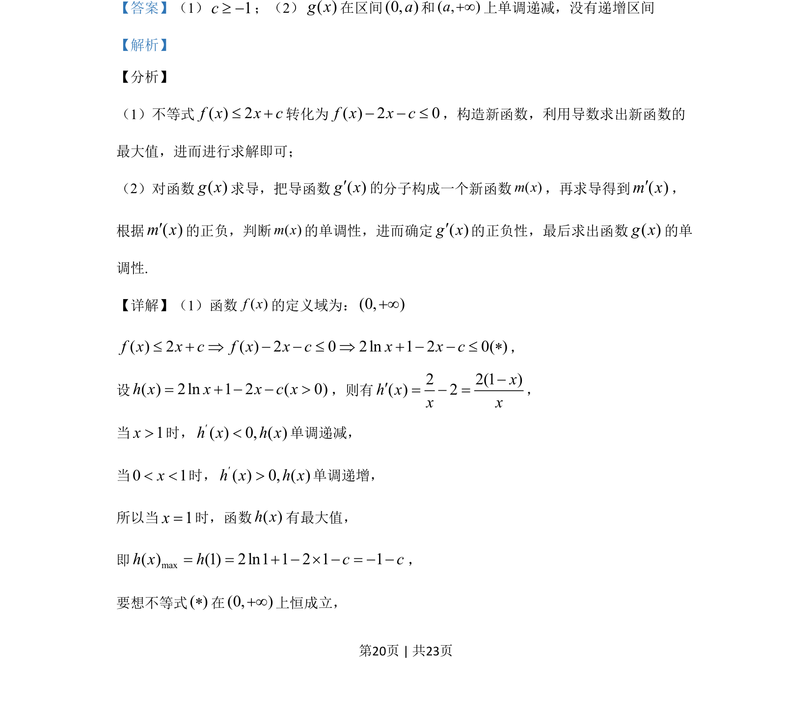
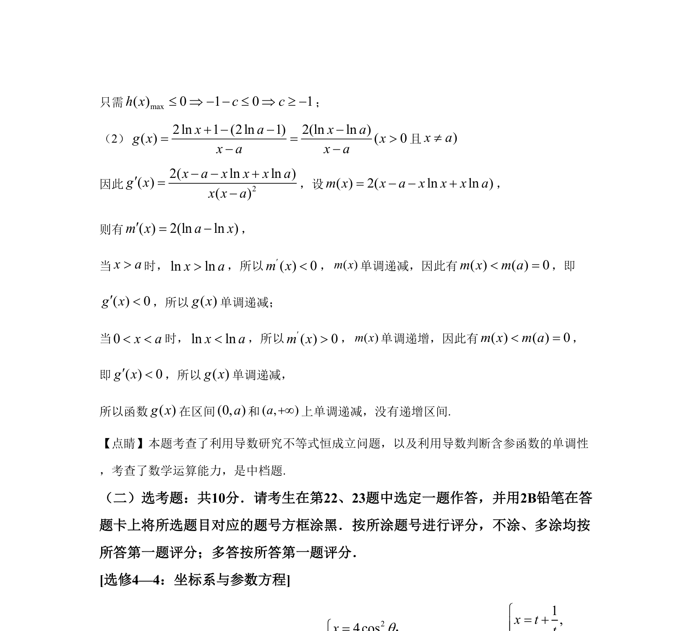

## 题面

## 摘要

本题考查利用导数解决不等式恒成立问题及含参函数单调性判定。

## 关联考点

- [[705-利用导数研究函数的单调性|导数与单调性]]
- [[838-导数与最值|导数与最值]]
- [[531-不等式恒成立|不等式恒成立]]

## 答案与解析

> 📄 原 PDF 第 20 页：`素材/真题/吉林/2008-2024·（吉林）数学高考真题/2020年高考数学试卷（文）（新课标Ⅱ）（解析卷）.pdf`

<!-- 题干文本-start -->
## 题干文本
21.已知函数f（x）=2lnx+1．
（1）若f（x）≤2x+c，求c的取值范围；
（2）设a>0时，讨论函数g（x）=( ) ( )f x f ax a--
的单调性．
<!-- 题干文本-end -->

<!-- 解析文本-start -->
## 解析文本
【答案】（1）1c³ -；（2）( )g x在区间(0, )a和( , )a+¥上单调递减，没有递增区间
【解析】
【分析】
（1）不等式( ) 2f x x c£ +转化为( ) 2 0f x x c- - £，构造新函数，利用导数求出新函数的
最大值，进而进行求解即可；
（2）对函数( )g x求导，把导函数( )g x¢分子构成一个新函数()mx，再求导得到( )m x¢，
根据( )m x¢的正负，判断()mx的单调性，进而确定( )g x¢的正负性，最后求出函数( )g x的单
调性.
【详解】（1）函数( )f x的定义域为：(0, )+¥( ) 2 ( ) 2 0 2ln 1 2 0( )f x x c f x x c x x c£ + Þ - - £ Þ + - - £ *，
设( ) 2ln 1 2 ( 0)h x x x c x= + - - >，则有2 2(1 )( ) 2xh xx x-¢= - =，
当1x>时，( ) 0, ( )h x h x¢<单调递减，
当0 1x< <时，( ) 0, ( )h x h x¢>单调递增，
所以当1x=时，函数( )h x有最大值，
即max( ) (1) 2ln1 1 2 1 1h x h c c= = + - ´ - = - -，
要想不等式( )*在(0, )+¥上恒成立，
的
<!-- 解析文本-end -->
