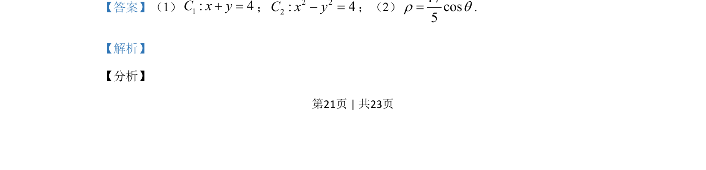
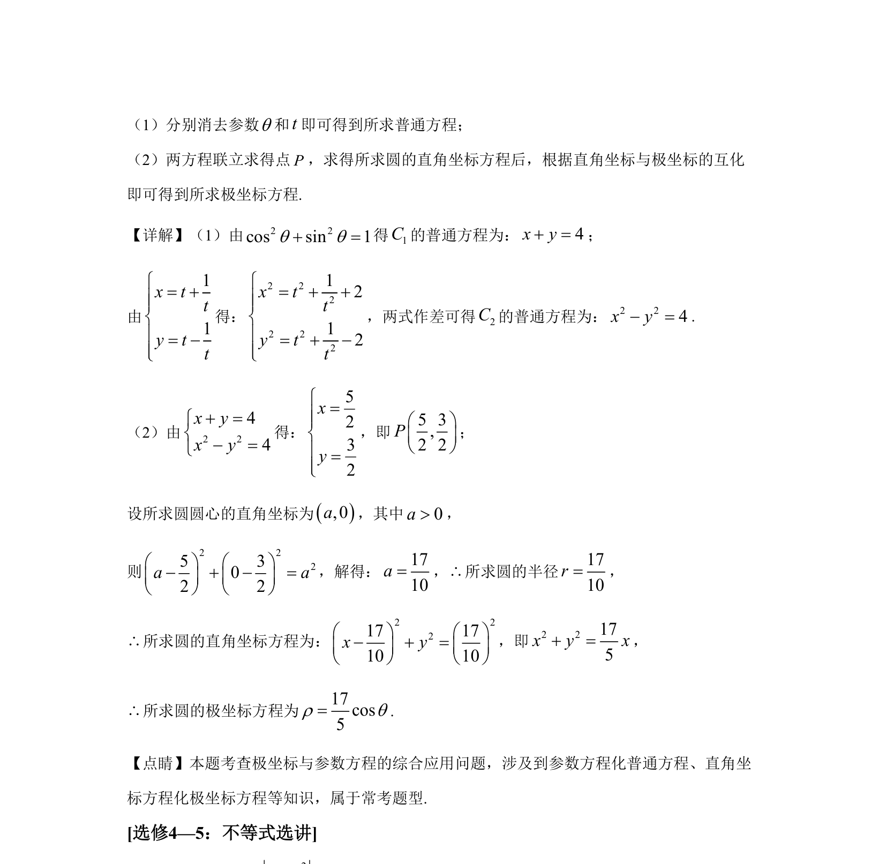

## 题面

## 摘要

题目考查参数方程与普通方程互化、直角坐标与极坐标互化及圆的方程求解。

## 关联考点

- [[723-参数方程化普通方程|参数方程化普通方程]]
- [[920-极坐标与直角坐标互化|极坐标与直角坐标互化]]
- [[782-圆的方程|圆的方程]]

## 答案与解析

> 📄 原 PDF 第 21 页：`素材/真题/吉林/2008-2024·（吉林）数学高考真题/2020年高考数学试卷（文）（新课标Ⅱ）（解析卷）.pdf`
