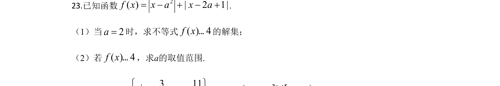
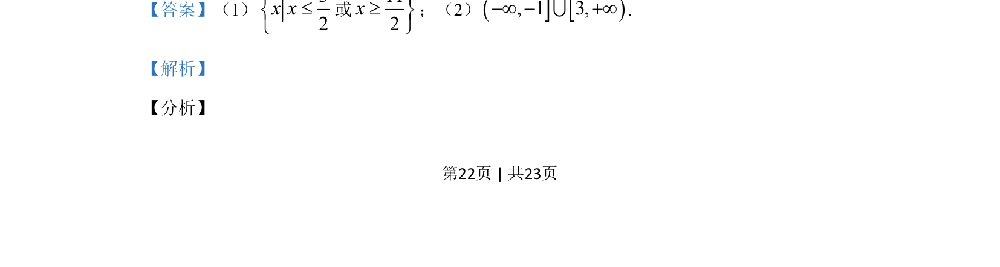
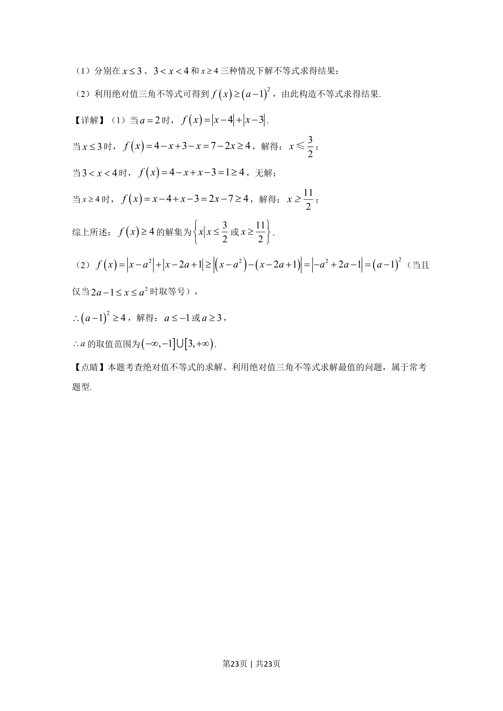

## 题面

## 摘要

该题考查含参绝对值不等式的分段求解及利用绝对值三角不等式求参数范围。

## 关联考点

- [[1093-绝对值不等式|绝对值不等式]]
- [[1221-分段求解|分段求解]]
- [[1159-绝对值三角不等式|绝对值三角不等式]]
- [[424-参数分类讨论|分类讨论]]

## 答案与解析

> 📄 原 PDF 第 22 页：`素材/真题/吉林/2008-2024·（吉林）数学高考真题/2020年高考数学试卷（文）（新课标Ⅱ）（解析卷）.pdf`
