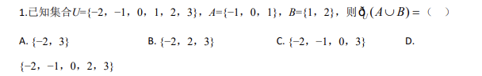
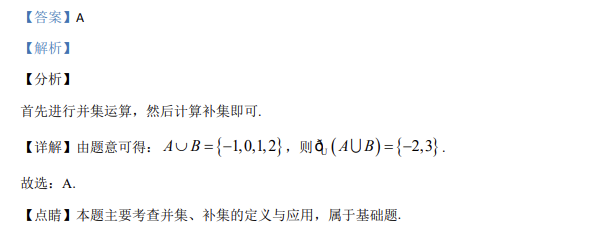

## 题面

## 摘要

已知全集U={-2,-1,0,1,2,3}及A、B, 求 ∁_U(A∪B)。

## 关联考点

- [[314-集合的运算|集合的运算]]
- [[550-并集|并集]]
- [[1101-补集|补集]]

## 答案与解析

> 📄 原 PDF 第 1 页：`素材/真题/吉林/2008-2024·（吉林）数学高考真题/2020年高考数学试卷（理）（新课标Ⅱ）（解析卷）.pdf`

<!-- 题干文本-start -->
## 题干文本
1.已知集合U={−2，−1，0，1，2，3}，A={−1，0，1}，B={1，2}，则( )UA BÈ =ð（    ）
A. {−2，3} B. {−2，2，3} C. {−2，−1，0，3} D. 
{−2，−1，0，2，3}
<!-- 题干文本-end -->

<!-- 解析文本-start -->
## 解析文本
【答案】A
【解析】
【分析】
首先进行并集运算，然后计算补集即可.
【详解】由题意可得：{}1,0,1, 2A BÈ = -，则(){}U2,3A B= -Uð.
故选：A.
【点睛】本题主要考查并集、补集的定义与应用，属于基础题.
<!-- 解析文本-end -->
