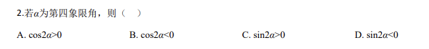
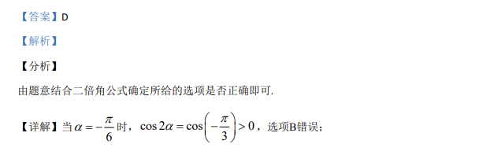

## 题面

## 摘要

已知α为第四象限角, 用二倍角公式判断 cos2α、sin2α 的正负。

## 关联考点

- [[637-二倍角公式|二倍角公式]]
- [[616-三角函数符号|三角函数符号]]
- [[1115-象限角|象限角]]

## 答案与解析

> 📄 原 PDF 第 1 页：`素材/真题/吉林/2008-2024·（吉林）数学高考真题/2020年高考数学试卷（理）（新课标Ⅱ）（解析卷）.pdf`
