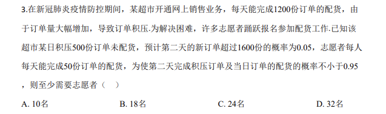
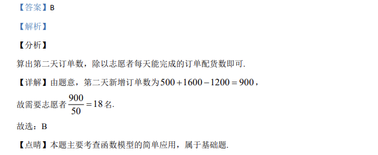

## 题面

## 摘要

新冠疫情网售配货, 求使"次日清积压且配货概率不小于0.95"所需最少志愿者人数。

## 关联考点

- [[1186-概率估计|概率估计]]
- [[469-二项分布|二项分布]]
- [[341-概率应用|概率应用]]

## 答案与解析

> 📄 原 PDF 第 1 页：`素材/真题/吉林/2008-2024·（吉林）数学高考真题/2020年高考数学试卷（理）（新课标Ⅱ）（解析卷）.pdf`

<!-- 题干文本-start -->
## 题干文本
3.考试结束后，将本试卷和答题卡一并交回.
一、选择题：本题共12小题，每小题5分，共60分.在每小题给出的四个选项中，
只有一项是符合题目要求的.
1.已知集合U={−2，−1，0，1，2，3}，A={−1，0，1}，B={1，2}，则( )UA BÈ =ð（    ）
A. {−2，3} B. {−2，2，3} C. {−2，−1，0，3} D. 
{−2，−1，0，2，3}
<!-- 题干文本-end -->

<!-- 解析文本-start -->
## 解析文本
【答案】A
【解析】
【分析】
首先进行并集运算，然后计算补集即可.
【详解】由题意可得：1,0,1, 2A BÈ = -，则U2,3A B= -Uð.
故选：A.
【点睛】本题主要考查并集、补集的定义与应用，属于基础题.
2.若α为第四象限角，则（    ）
A. cos2α>0 B. cos2α<0 C. sin2α>0 D. sin2α<0
【答案】D
【解析】
【分析】
由题意结合二倍角公式确定所给的选项是否正确即可.
【详解】当
6pa= -时，cos 2 cos 03paæ ö= - >ç ÷è ø
，选项B错误；
<!-- 解析文本-end -->
