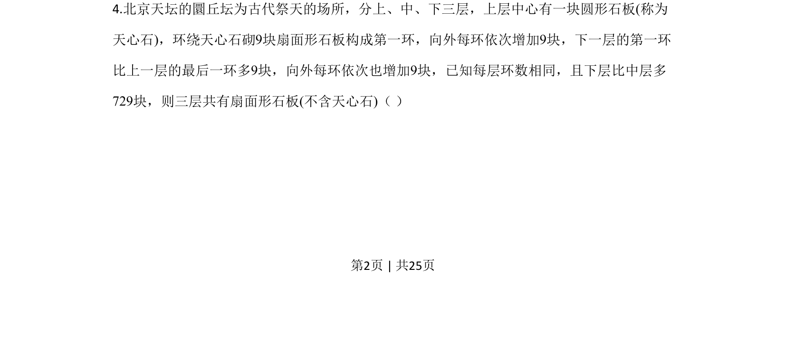
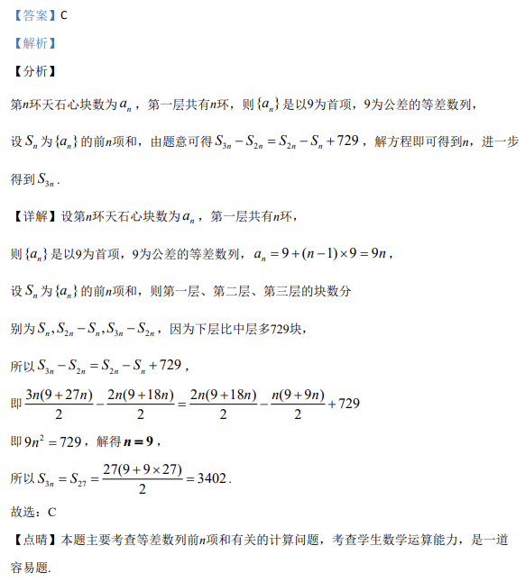

## 题面

## 摘要

通过天石心块数等差数列模型，利用层数块数差建立方程求解环数

## 关联考点

- [[356-等差数列概念|等差数列]]
- [[355-等差数列前n项和|等差数列前n项和]]
- [[061-方程|方程求解]]

## 答案与解析

> 📄 原 PDF 第 2 页：`素材/真题/吉林/2008-2024·（吉林）数学高考真题/2020年高考数学试卷（理）（新课标Ⅱ）（解析卷）.pdf`
