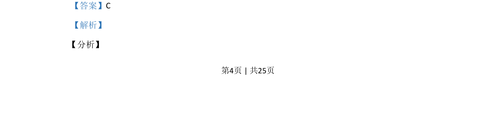

## 题面

## 摘要

已知数列递推求通项及等比数列求和，利用求和公式建立方程求参数值

## 关联考点

- [[358-等比数列概念|等比数列]]
- [[384-数列通项公式|通项公式]]
- [[求和公式]]
- [[061-方程|方程求解]]

## 答案与解析

> 📄 原 PDF 第 4 页：`素材/真题/吉林/2008-2024·（吉林）数学高考真题/2020年高考数学试卷（理）（新课标Ⅱ）（解析卷）.pdf`
