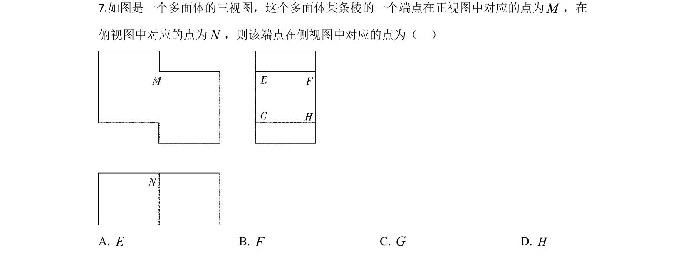
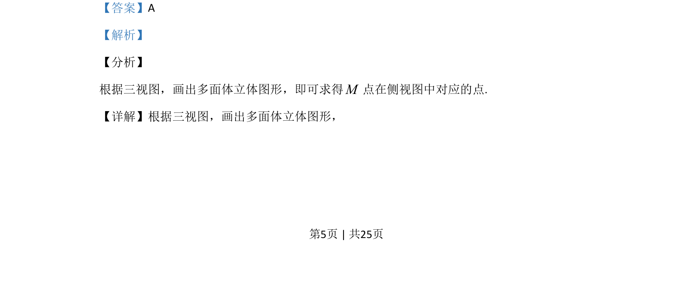

## 题面

## 摘要

本题通过三视图还原立体图形，判断给定点在侧视图中的对应位置。

## 关联考点

- [[235-三视图|三视图]]
- [[1054-空间想象能力|空间想象能力]]
- [[1056-立体图形还原|立体图形还原]]

## 答案与解析

> 📄 原 PDF 第 5 页：`素材/真题/吉林/2008-2024·（吉林）数学高考真题/2020年高考数学试卷（理）（新课标Ⅱ）（解析卷）.pdf`
