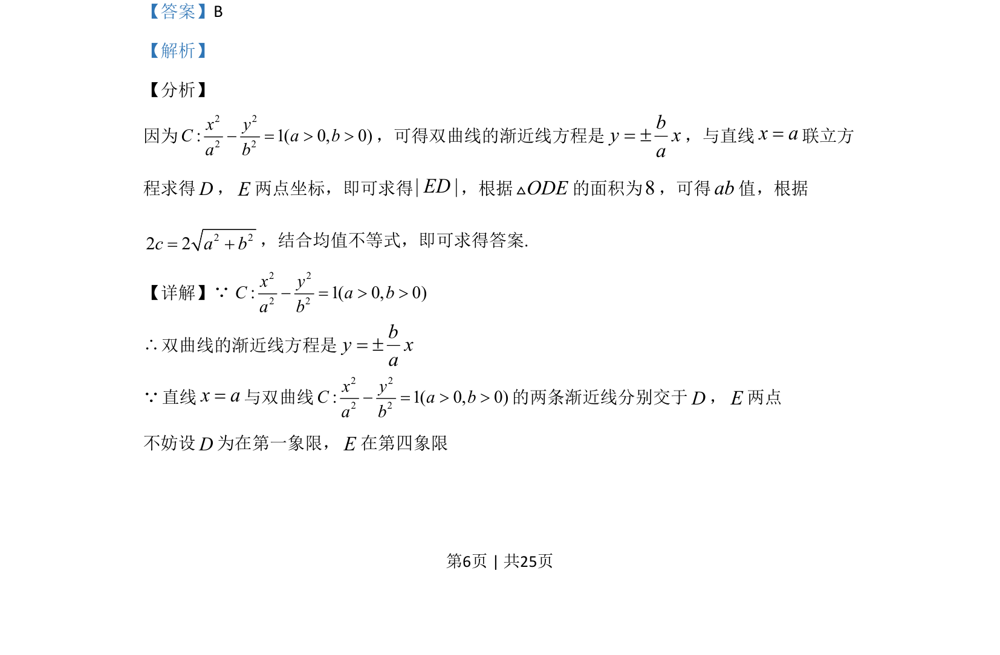

## 题面

## 摘要

本题通过双曲线渐近线与直线交点构建三角形，结合面积与均值不等式求焦距最小值。

## 关联考点

- [[369-双曲线渐近线|双曲线的渐近线]]
- [[062-多边形面积|三角形面积]]
- [[295-基本不等式|均值不等式]]
- [[735-双曲线的焦距|双曲线的焦距]]

## 答案与解析

> 📄 原 PDF 第 6 页：`素材/真题/吉林/2008-2024·（吉林）数学高考真题/2020年高考数学试卷（理）（新课标Ⅱ）（解析卷）.pdf`

<!-- 题干文本-start -->
## 题干文本
8.设O为坐标原点，直线x a=与双曲线
2 22 2: 1( 0, 0)x yC a ba b- = > >的两条渐近线分别交于
,D E两点，若ODEV的面积为8，则C的焦距的最小值为（    ）
A. 4 B. 8 C. 16 D. 32
<!-- 题干文本-end -->

<!-- 解析文本-start -->
## 解析文本
【答案】B
【解析】
【分析】
因为
2 22 2: 1( 0, 0)x yC a ba b- = > >，可得双曲线的渐近线方程是by xa= ±，与直线x a=联立方
程求得D，E两点坐标，即可求得| |ED，根据ODEV的面积为8，可得ab值，根据
2 22 2c a b= +，结合均值不等式，即可求得答案.
【详解】Q2 22 2: 1( 0, 0)x yC a ba b- = > >\双曲线的渐近线方程是by xa= ±Q直线x a=与双曲线
2 22 2: 1( 0, 0)x yC a ba b- = > >的两条渐近线分别交于D，E两点
不妨设D为在第一象限，E在第四象限
<!-- 解析文本-end -->
