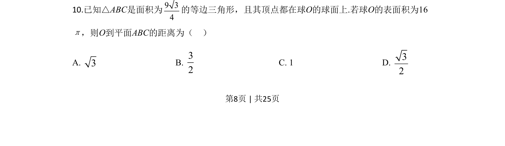
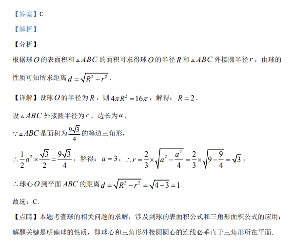

## 题面

## 摘要

已知球的表面积和等边三角形面积，求球心到三角形所在平面的距离。

## 关联考点

- [[994-球的表面积|球的表面积]]
- [[581-等边三角形面积|等边三角形面积]]
- [[546-外接圆半径|外接圆半径]]
- [[990-球心到平面的距离|球心到平面的距离]]

## 答案与解析

> 📄 原 PDF 第 8 页：`素材/真题/吉林/2008-2024·（吉林）数学高考真题/2020年高考数学试卷（理）（新课标Ⅱ）（解析卷）.pdf`
