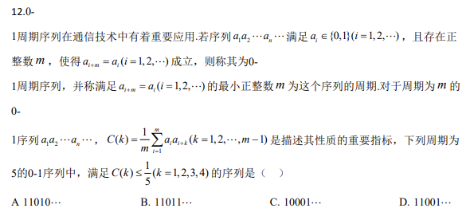
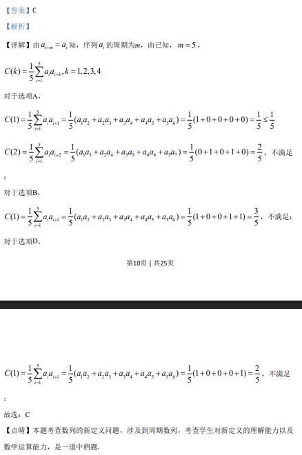

## 题面

## 摘要

0-1 周期序列与自相关函数 C(k)，多选满足 C(k)≤1/5 的 5 周期序列。

## 关联考点

- [[381-数列概念-高中|数列]]
- [[周期序列]]
- [[自相关函数]]
- [[离散数学]]
- [[多选题]]

## 答案与解析

> 📄 原 PDF 第 9 页：`素材/真题/吉林/2008-2024·（吉林）数学高考真题/2020年高考数学试卷（理）（新课标Ⅱ）（解析卷）.pdf`
