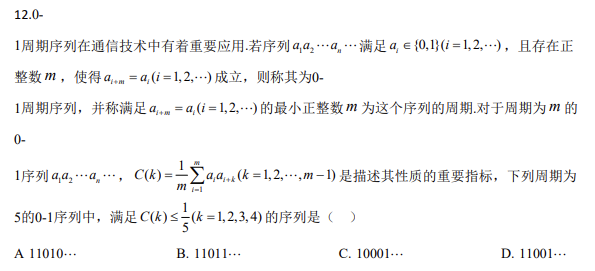
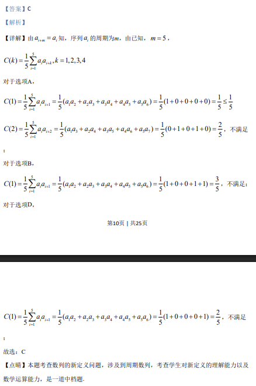

## 题面

## 摘要

0-1 周期序列与自相关函数 C(k)，多选满足 C(k)≤1/5 的 5 周期序列。

## 关联考点

- [[381-数列概念-高中|数列]]
- [[760-周期序列|周期序列]]
- [[1188-自相关函数|自相关函数]]
- [[1040-离散数学|离散数学]]
- [[814-多选题|多选题]]

## 答案与解析

> 📄 原 PDF 第 9 页：`素材/真题/吉林/2008-2024·（吉林）数学高考真题/2020年高考数学试卷（理）（新课标Ⅱ）（解析卷）.pdf`

<!-- 题干文本-start -->
## 题干文本

<!-- 题干文本-end -->

<!-- 解析文本-start -->
## 解析文本
第9页 | 共25页  
【答案】C
【解析】
【分析】
根据球O的表面积和ABCV的面积可求得球O的半径R和ABCV外接圆半径r，由球的
性质可知所求距离 2 2d R r= -.
【详解】设球O的半径为R，则24 16Rp p=，解得：2R=.
设ABCV外接圆半径为r，边长为a， 
ABCQV是面积为9 34
的等边三角形，
21 3 9 32 2 4a\ ´ =，解得：3a=，
222 2 99 33 4 3 4ar a\ = ´ - = ´ - =，
\球心O到平面ABC的距离 2 24 3 1d R r= - = - =.
故选：C.
【点睛】本题考查球的相关问题的求解，涉及到球的表面积公式和三角形面积公式的应用；
解题关键是明确球的性质，即球心和三角形外接圆圆心的连线必垂直于三角形所在平面.
11.若2 2 3 3x y x y- -- < -，则（    ）
A. ln( 1) 0y x- + >B. ln( 1) 0y x- + <C. ln | | 0x y- >D. 
ln | | 0x y- <
【答案】A
【解析】
【分析】
将不等式变为2 3 2 3x x y y- -- < -，根据2 3t tf t-= -的单调性知x y<，以此去判断各个
选项中真数与1的大小关系，进而得到结果.
【详解】由2 2 3 3x y x y- -- < -得：2 3 2 3x x y y- -- < -，
令2 3t tf t-= -，
2xy=Q为R上的增函数，3xy-=为R上的减函数，f t\为R上的增函数，
x y\ <，
<!-- 解析文本-end -->
