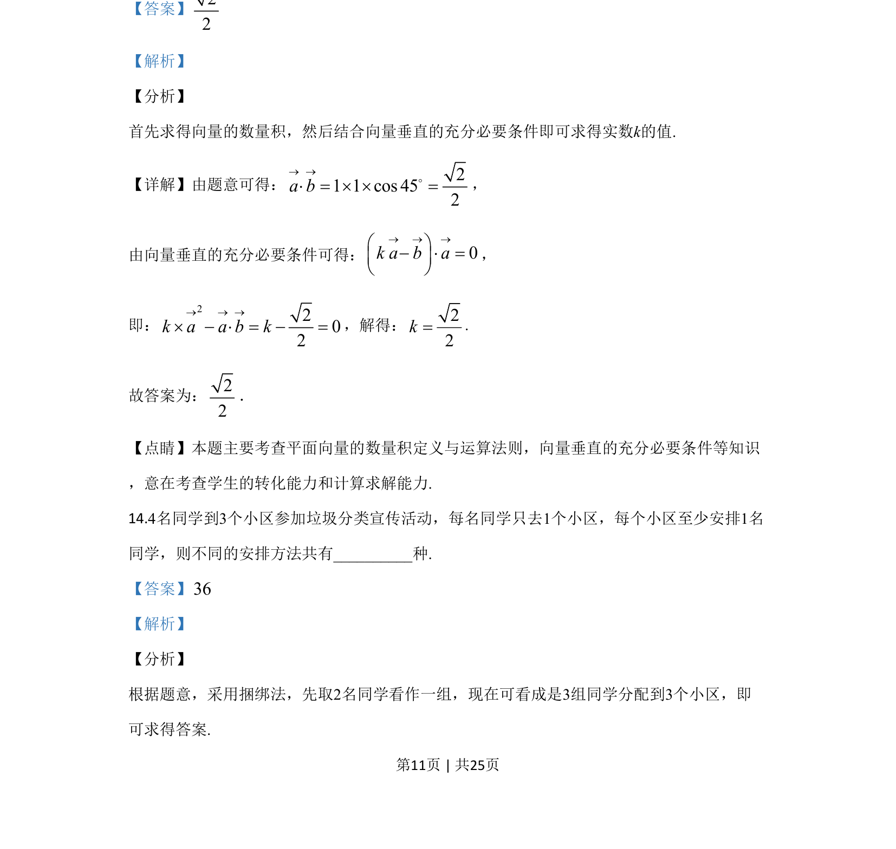

## 题面

## 摘要

已知单位向量a、b夹角为45°，ka-b与a垂直，利用数量积条件求k的值。

## 关联考点

- [[853-平面向量|平面向量]]
- [[328-向量的数量积|数量积]]
- [[748-向量垂直条件|向量垂直条件]]

## 答案与解析

> 📄 原 PDF 第 11 页：`素材/真题/吉林/2008-2024·（吉林）数学高考真题/2020年高考数学试卷（理）（新课标Ⅱ）（解析卷）.pdf`
