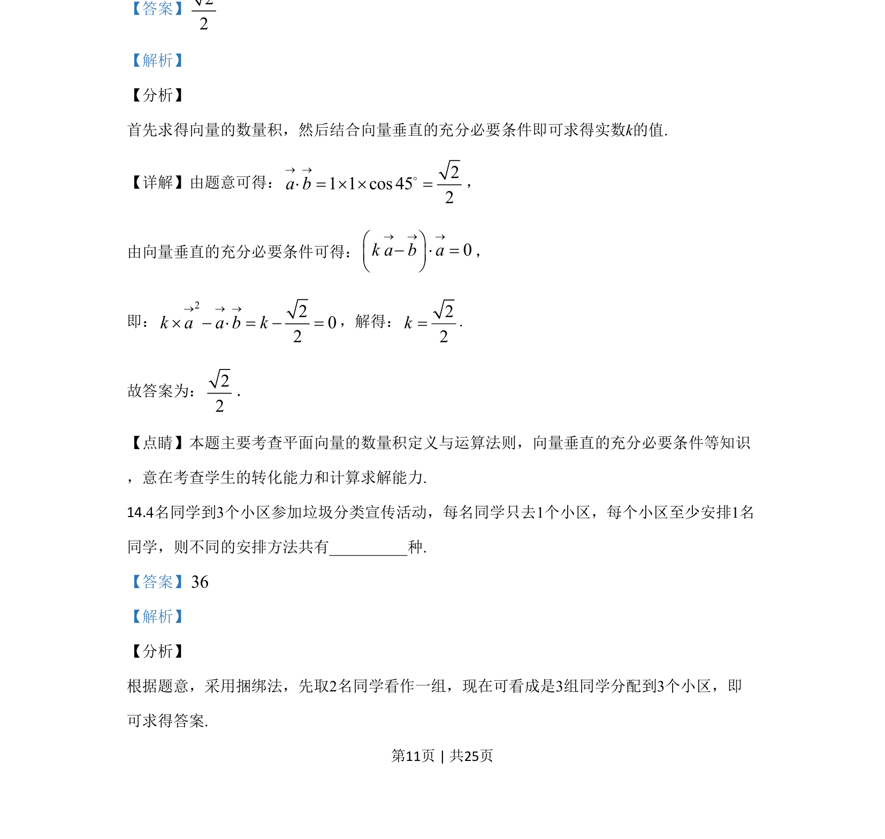

## 题面

## 摘要

已知单位向量a、b夹角为45°，ka-b与a垂直，利用数量积条件求k的值。

## 关联考点

- [[853-平面向量|平面向量]]
- [[328-向量的数量积|数量积]]
- [[748-向量垂直条件|向量垂直条件]]

## 答案与解析

> 📄 原 PDF 第 11 页：`素材/真题/吉林/2008-2024·（吉林）数学高考真题/2020年高考数学试卷（理）（新课标Ⅱ）（解析卷）.pdf`

<!-- 题干文本-start -->
## 题干文本
13.已知单位向量a，b的夹角为45°，ka–b与a垂直，则k=__________.
<!-- 题干文本-end -->

<!-- 解析文本-start -->
## 解析文本
【答案】22
【解析】
【分析】
首先求得向量的数量积，然后结合向量垂直的充分必要条件即可求得实数k的值.
【详解】由题意可得： 21 1 cos 452a b® ®× = ´ ´ =o，
由向量垂直的充分必要条件可得： 0k a b a® ® ®æ ö- × =ç ÷è ø
，
即：
2202k a a b k® ® ®´ - × = - =，解得：22k=.
故答案为：22
．
【点睛】本题主要考查平面向量的数量积定义与运算法则，向量垂直的充分必要条件等知识
，意在考查学生的转化能力和计算求解能力.
<!-- 解析文本-end -->
