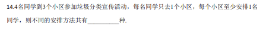
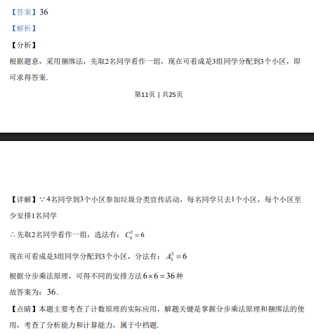

## 题面

## 摘要

4 名同学分到 3 个小区，每人只去 1 个小区，每小区至少 1 人，求安排方法数。

## 关联考点

- [[031-搭配|排列组合]]
- [[699-分组分配|分组分配]]
- [[1112-计数原理|计数原理]]
- [[888-插板法|插板法]]

## 答案与解析

> 📄 原 PDF 第 12 页：`素材/真题/吉林/2008-2024·（吉林）数学高考真题/2020年高考数学试卷（理）（新课标Ⅱ）（解析卷）.pdf`
