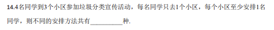
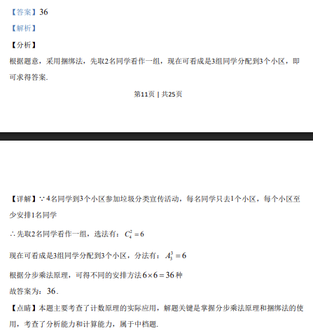

## 题面

## 摘要

4 名同学分到 3 个小区，每人只去 1 个小区，每小区至少 1 人，求安排方法数。

## 关联考点

- [[031-搭配|排列组合]]
- [[699-分组分配|分组分配]]
- [[1112-计数原理|计数原理]]
- [[888-插板法|插板法]]

## 答案与解析

> 📄 原 PDF 第 12 页：`素材/真题/吉林/2008-2024·（吉林）数学高考真题/2020年高考数学试卷（理）（新课标Ⅱ）（解析卷）.pdf`

<!-- 题干文本-start -->
## 题干文本

<!-- 题干文本-end -->

<!-- 解析文本-start -->
## 解析文本
第12页 | 共25页  
【详解】Q4名同学到3个小区参加垃圾分类宣传活动，每名同学只去1个小区，每个小区至
少安排1名同学
\先取2名同学看作一组，选法有：246C=
现在可看成是3组同学分配到3个小区，分法有：336A=
根据分步乘法原理，可得不同的安排方法6 6 36´ =种
故答案为：36.
【点睛】本题主要考查了计数原理的实际应用，解题关键是掌握分步乘法原理和捆绑法的使
用，考查了分析能力和计算能力，属于中档题.
15.设复数1z，2z满足1 2| |=| |=2z z，1 23 iz z+ = +，则1 2| |z z-=__________.
【答案】2 3
【解析】
【分析】
令12cos 2sinz iq q= + ×，22cos 2sinz ia a= + ×，根据复数的相等可求得
1cos cos sin sin2q a q a+ = -，代入复数模长的公式中即可得到结果.
【详解】1 22z z= =Q，可设12cos 2sinz iq q= + ×，22cos 2sinz ia a= + ×，
1 22 cos cos 2 sin sin 3z z i iq a q a\ + = + + + × = +，
2 cos cos 32 sin sin 1q aq aì+ =ï\í+ =ïî
，两式平方作和得：4 2 2cos cos 2sin sin 4q a q a+ + =，
化简得： 1cos cos sin sin2q a q a+ = -1 22 cos cos 2 sin sinz z iq a q a\ - = - + - ×2 24 cos cos 4 sin sin 8 8 cos cos sin sinq a q a q a q a= - + - = - +8 4 2 3= + =
故答案为：2 3.
【点睛】本题考查复数模长的求解，涉及到复数相等的应用；关键是能够采用假设的方式，
<!-- 解析文本-end -->
