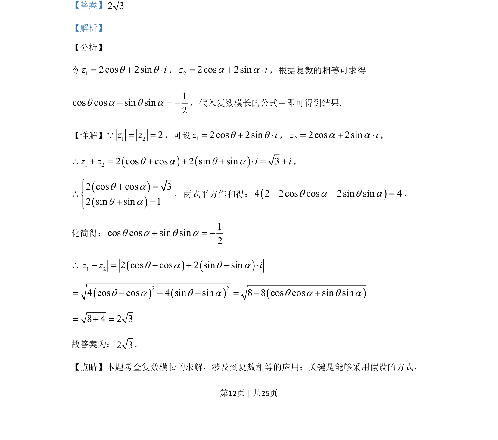

## 题面

## 摘要

已知复数z₁、z₂满足|z₁|=|z₂|=2且z₁+z₂=√3+i，求|z₁-z₂|。

## 关联考点

- [[330-复数概念|复数]]
- [[803-复数模长|复数模长]]
- [[811-复数运算|复数运算]]

## 答案与解析

> 📄 原 PDF 第 12 页：`素材/真题/吉林/2008-2024·（吉林）数学高考真题/2020年高考数学试卷（理）（新课标Ⅱ）（解析卷）.pdf`

<!-- 题干文本-start -->
## 题干文本
15.设复数1z，2z满足1 2| |=| |=2z z，1 23 iz z+ = +，则1 2| |z z-=__________.
<!-- 题干文本-end -->

<!-- 解析文本-start -->
## 解析文本
【答案】2 3
【解析】
【分析】
令12cos 2sinz iq q= + ×，22cos 2sinz ia a= + ×，根据复数的相等可求得
1cos cos sin sin2q a q a+ = -，代入复数模长的公式中即可得到结果.
【详解】1 22z z= =Q，可设12cos 2sinz iq q= + ×，22cos 2sinz ia a= + ×，
()()1 22 cos cos 2 sin sin 3z z i iq a q a\ + = + + + × = +，
()()2 cos cos 32 sin sin 1q aq aì+ =ï\í+ =ïî
，两式平方作和得：()4 2 2cos cos 2sin sin 4q a q a+ + =，
化简得： 1cos cos sin sin2q a q a+ = -()()1 22 cos cos 2 sin sinz z iq a q a\ - = - + - ×()()()2 24 cos cos 4 sin sin 8 8 cos cos sin sinq a q a q a q a= - + - = - +8 4 2 3= + =
故答案为：2 3.
【点睛】本题考查复数模长的求解，涉及到复数相等的应用；关键是能够采用假设的方式，
<!-- 解析文本-end -->
