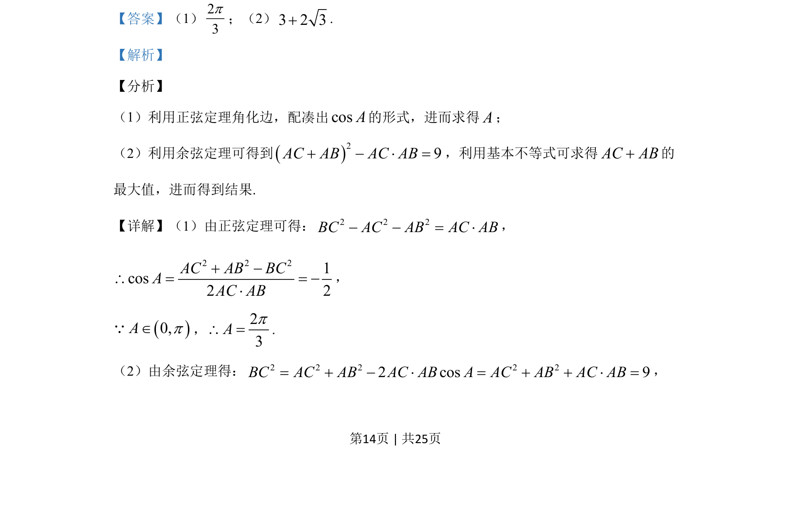

## 题面

## 摘要

△ABC中sin²A-sin²B-sin²C=sinBsinC，用正弦定理转化求角A=2π/3，再求BC=3时周长最大值。

## 关联考点

- [[270-三角函数应用|三角函数]]
- [[126-定理|正弦定理]]
- [[083-不等式|不等式]]

## 答案与解析

> 📄 原 PDF 第 14 页：`素材/真题/吉林/2008-2024·（吉林）数学高考真题/2020年高考数学试卷（理）（新课标Ⅱ）（解析卷）.pdf`
