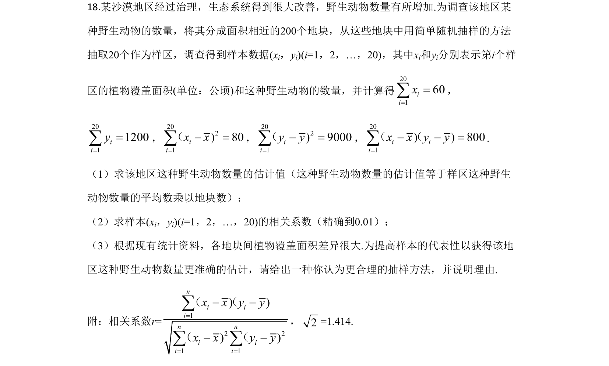
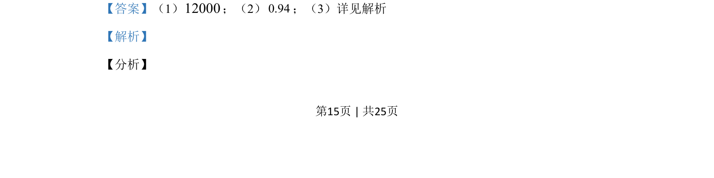

## 题面

## 摘要

某地野生动物数量调查抽样数据，求数量点估计、线性相关系数，并判断更合理的抽样方法。

## 关联考点

- [[141-统计图|统计]]
- [[359-统计案例|线性回归]]
- [[882-抽样方法|抽样方法]]

## 答案与解析

> 📄 原 PDF 第 15 页：`素材/真题/吉林/2008-2024·（吉林）数学高考真题/2020年高考数学试卷（理）（新课标Ⅱ）（解析卷）.pdf`
