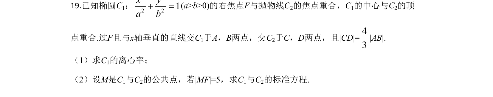
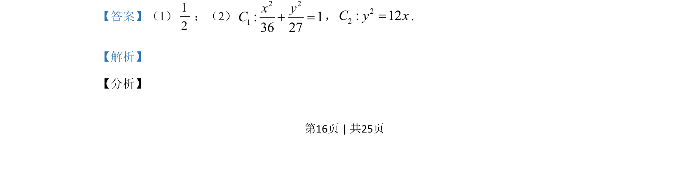

## 题面

## 摘要

椭圆C₁右焦点与抛物线C₂焦点重合且中心与顶点重合，利用焦点弦关系求椭圆离心率及两曲线标准方程。

## 关联考点

- [[1111-解析几何|解析几何]]
- [[389-椭圆定义与方程|椭圆]]
- [[227-抛物线|抛物线]]
- [[391-椭圆离心率|离心率]]

## 答案与解析

> 📄 原 PDF 第 16 页：`素材/真题/吉林/2008-2024·（吉林）数学高考真题/2020年高考数学试卷（理）（新课标Ⅱ）（解析卷）.pdf`
