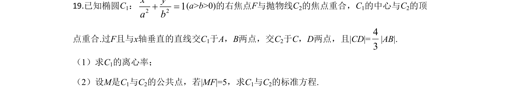
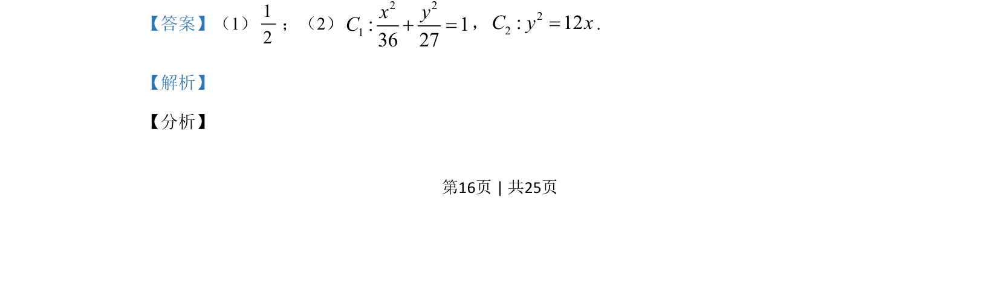

## 题面

## 摘要

椭圆C₁右焦点与抛物线C₂焦点重合且中心与顶点重合，利用焦点弦关系求椭圆离心率及两曲线标准方程。

## 关联考点

- [[1111-解析几何|解析几何]]
- [[389-椭圆定义与方程|椭圆]]
- [[227-抛物线|抛物线]]
- [[391-椭圆离心率|离心率]]

## 答案与解析

> 📄 原 PDF 第 16 页：`素材/真题/吉林/2008-2024·（吉林）数学高考真题/2020年高考数学试卷（理）（新课标Ⅱ）（解析卷）.pdf`

<!-- 题干文本-start -->
## 题干文本
19.已知椭圆C1：
2 22 21x ya b+ =(a>b>0)的右焦点F与抛物线C2的焦点重合，C1的中心与C2的顶
点重合.过F且与x轴垂直的直线交C1于A，B两点，交C2于C，D两点，且|CD|=43
|AB|.
（1）求C1的离心率；
（2）设M是C1与C2的公共点，若|MF|=5，求C1与C2的标准方程.
<!-- 题干文本-end -->

<!-- 解析文本-start -->
## 解析文本
【答案】（1）12；（2）
2 21: 136 27x yC+ =， 22: 12C y x=.
【解析】
【分析】
<!-- 解析文本-end -->
