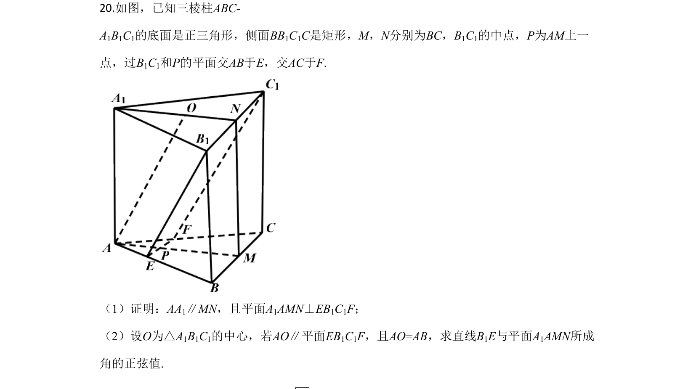
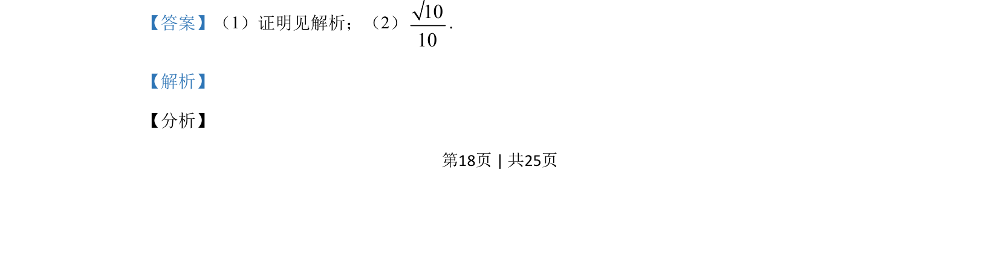

## 题面

## 摘要

正三角形底面三棱柱中，证AA₁//MN且平面A₁AMN⊥EB₁C₁F，再求直线B₁E与平面A₁AMN所成角正弦值√10/10。

## 关联考点

- [[1055-立体几何|立体几何]]
- [[583-线面关系|线面关系]]
- [[401-空间向量基本概念|空间向量]]

## 答案与解析

> 📄 原 PDF 第 18 页：`素材/真题/吉林/2008-2024·（吉林）数学高考真题/2020年高考数学试卷（理）（新课标Ⅱ）（解析卷）.pdf`
