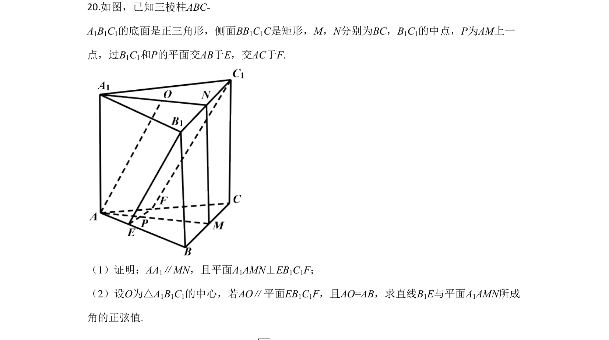
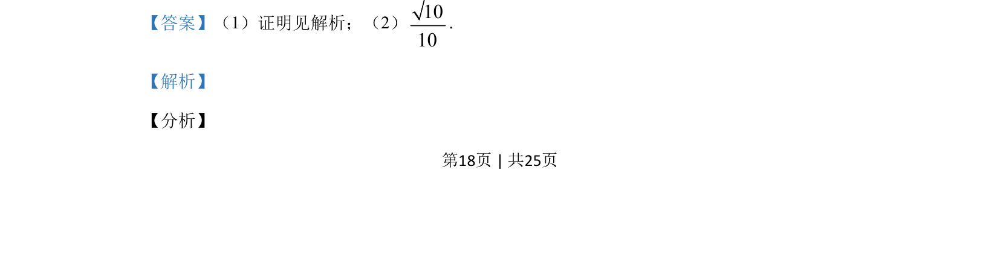

## 题面

## 摘要

正三角形底面三棱柱中，证AA₁//MN且平面A₁AMN⊥EB₁C₁F，再求直线B₁E与平面A₁AMN所成角正弦值√10/10。

## 关联考点

- [[1055-立体几何|立体几何]]
- [[583-线面关系|线面关系]]
- [[401-空间向量基本概念|空间向量]]

## 答案与解析

> 📄 原 PDF 第 18 页：`素材/真题/吉林/2008-2024·（吉林）数学高考真题/2020年高考数学试卷（理）（新课标Ⅱ）（解析卷）.pdf`

<!-- 题干文本-start -->
## 题干文本
20.如图，已知三棱柱ABC-
A1B1C1的底面是正三角形，侧面BB1C1C是矩形，M，N分别为BC，B1C1的中点，P为AM上一
点，过B1C1和P的平面交AB于E，交AC于F.
（1）证明：AA1∥MN，且平面A1AMN⊥EB1C1F；
（2）设O为△A1B1C1的中心，若AO∥平面EB1C1F，且AO=AB，求直线B1E与平面A1AMN所成
角的正弦值.
<!-- 题干文本-end -->

<!-- 解析文本-start -->
## 解析文本
【答案】（1）证明见解析；（2）1010
.
【解析】
【分析】
<!-- 解析文本-end -->
