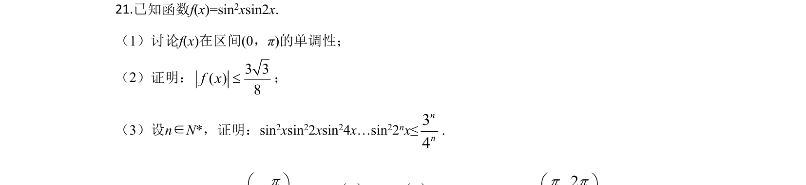
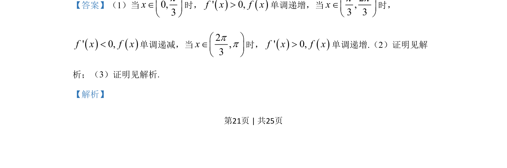

## 题面

## 摘要

f(x)=sin²xsin2x，讨论(0,π)单调性，证明|f(x)|≤3√3/8及sin²xsin²2x…sin²(2ⁿx)≤(3/4)ⁿ。

## 关联考点

- [[270-三角函数应用|三角函数]]
- [[425-反函数导数|导数]]
- [[625-不等式证明|不等式证明]]

## 答案与解析

> 📄 原 PDF 第 21 页：`素材/真题/吉林/2008-2024·（吉林）数学高考真题/2020年高考数学试卷（理）（新课标Ⅱ）（解析卷）.pdf`
