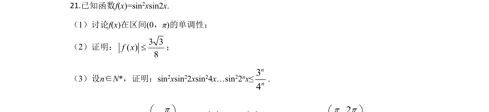
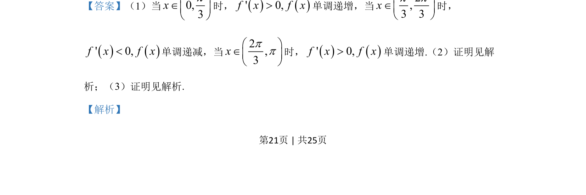

## 题面

## 摘要

f(x)=sin²xsin2x，讨论(0,π)单调性，证明|f(x)|≤3√3/8及sin²xsin²2x…sin²(2ⁿx)≤(3/4)ⁿ。

## 关联考点

- [[270-三角函数应用|三角函数]]
- [[425-反函数导数|导数]]
- [[624-不等式的证明|不等式证明]]

## 答案与解析

> 📄 原 PDF 第 21 页：`素材/真题/吉林/2008-2024·（吉林）数学高考真题/2020年高考数学试卷（理）（新课标Ⅱ）（解析卷）.pdf`

<!-- 题干文本-start -->
## 题干文本
21.已知函数f(x)=sin2xsin2x.
（1）讨论f(x)在区间(0，π)的单调性；
（2）证明：3 3( )8f x£；
（3）设n∈N*，证明：sin2xsin22xsin24x…sin22nx≤34nn.
<!-- 题干文本-end -->

<!-- 解析文本-start -->
## 解析文本
【答案】（1）当0,3xpæ öÎç ÷è ø
时，' 0,f x f x>单调递增，当2,3 3xp pæ öÎç ÷è ø
时，
' 0,f x f x<单调递减，当
2,3xppæ öÎç ÷è ø
时，' 0,f x f x>单调递增.（2）证明见解
析；（3）证明见解析.
【解析】
<!-- 解析文本-end -->
