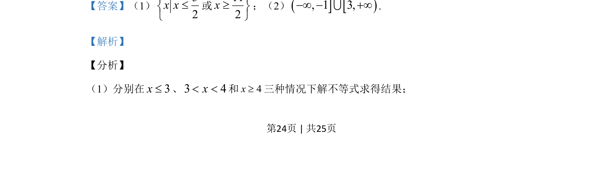

## 题面

## 摘要

f(x)=|x-a²|+|x-2a+1|（选修4-5），分当a=2时求不等式f(x)≤4解集，及f(x)≤4恒成立求a取值范围。

## 关联考点

- [[1093-绝对值不等式|绝对值不等式]]
- [[424-参数分类讨论|分类讨论]]
- [[721-参数取值范围|参数取值范围]]

## 答案与解析

> 📄 原 PDF 第 24 页：`素材/真题/吉林/2008-2024·（吉林）数学高考真题/2020年高考数学试卷（理）（新课标Ⅱ）（解析卷）.pdf`
