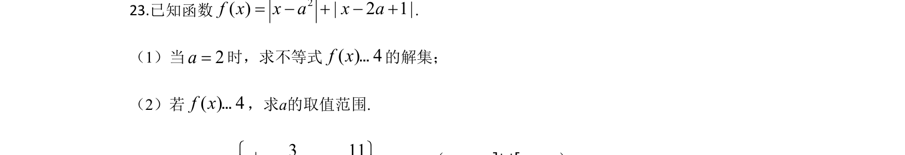
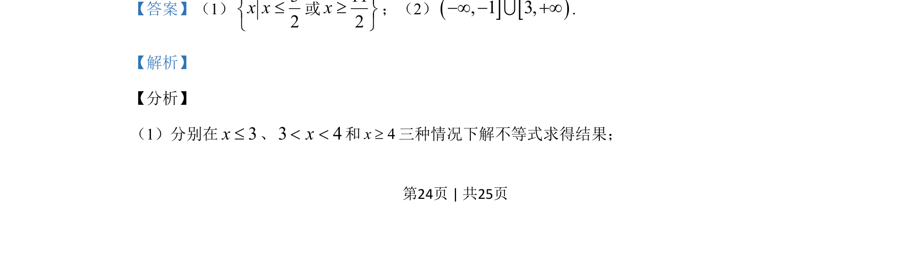

## 题面

## 摘要

f(x)=|x-a²|+|x-2a+1|（选修4-5），分当a=2时求不等式f(x)≤4解集，及f(x)≤4恒成立求a取值范围。

## 关联考点

- [[1092-绝对值不等式|绝对值不等式]]
- [[424-参数分类讨论|分类讨论]]
- [[721-参数取值范围|参数取值范围]]

## 答案与解析

> 📄 原 PDF 第 24 页：`素材/真题/吉林/2008-2024·（吉林）数学高考真题/2020年高考数学试卷（理）（新课标Ⅱ）（解析卷）.pdf`

<!-- 题干文本-start -->
## 题干文本
23.已知函数 2( ) | 2 1|f x x a x a= - + - +.
（1）当2a=时，求不等式( ) 4f x…的解集；
（2）若( ) 4f x…，求a的取值范围.
<!-- 题干文本-end -->

<!-- 解析文本-start -->
## 解析文本
【答案】（1）32x xì£íî
或112xü³ýþ
；（2）, 1 3,-¥ - +¥U.
【解析】
【分析】
（1）分别在3x£、3 4x< <和4x³三种情况下解不等式求得结果；
<!-- 解析文本-end -->
