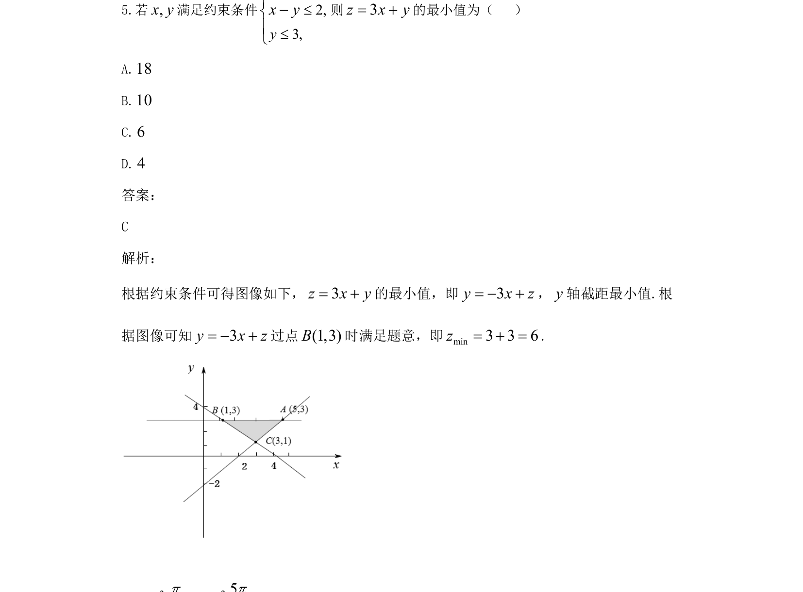
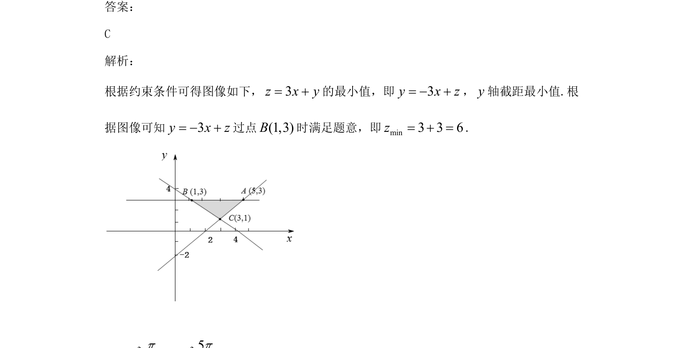

## 题面

## 摘要

线性规划求目标函数最小值，利用截距几何意义求解

## 关联考点

- [[1074-简单线性规划|线性规划]]
- [[999-目标函数|目标函数]]
- [[1028-直线的截距|截距]]

## 答案与解析

> 📄 原 PDF 第 3 页：`素材/真题/吉林/2008-2024·（吉林）数学高考真题/2021年高考数学试卷（文）（全国乙卷）（新课标Ⅰ）（解析卷）.pdf`

<!-- 题干文本-start -->
## 题干文本
5.若,x y满足约束条件2,3,4,yxyxy+³-
则3z x y= +的最小值为（   ）
A.18
B.10
C.6
D.4
答案：
C
解析：
根据约束条件可得图像如下，3z x y= +的最小值，即3y x z= - +，y轴截距最小值.根
据图像可知3y x z= - +过点(1,3)B时满足题意，即min3 3 6z= + =.
<!-- 题干文本-end -->

<!-- 解析文本-start -->
## 解析文本

<!-- 解析文本-end -->
