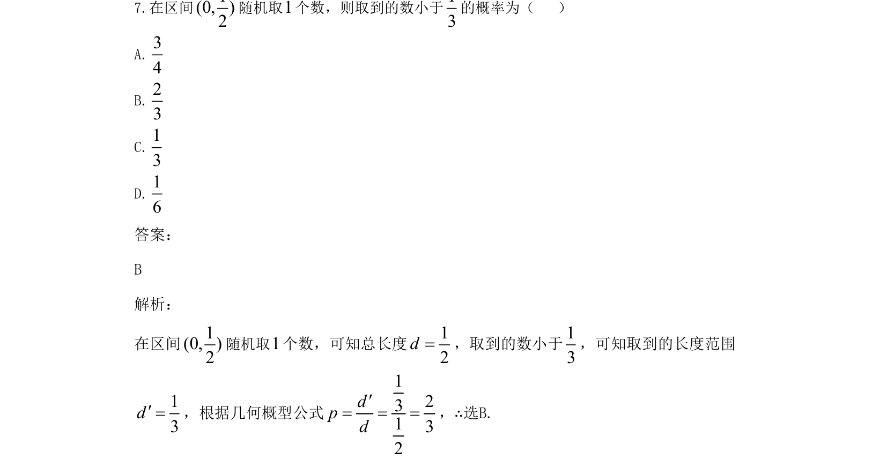
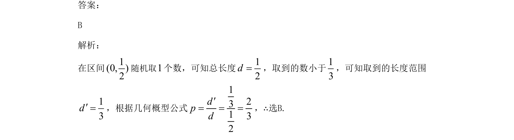

## 题面

## 摘要

该题考查在给定区间内随机取数，求事件“小于某值”的几何概型概率计算。

## 关联考点

- [[667-几何概型|几何概型]]
- [[948-概率计算|概率计算]]
- [[716-区间长度|区间长度]]

## 答案与解析

> 📄 原 PDF 第 4 页：`素材/真题/吉林/2008-2024·（吉林）数学高考真题/2021年高考数学试卷（文）（全国乙卷）（新课标Ⅰ）（解析卷）.pdf`
