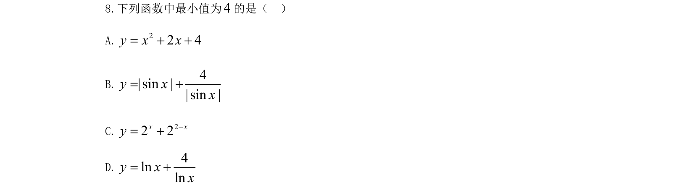
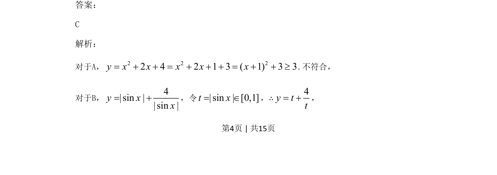
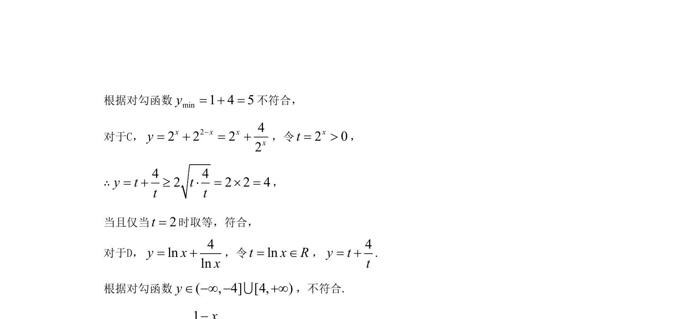

## 题面

## 摘要

本题考查运用基本不等式求不同函数的最小值，需注意等号成立条件。

## 关联考点

- [[419-函数最值-高中|函数最值]]
- [[295-基本不等式|基本不等式]]
- [[212-二次函数定义|二次函数]]
- [[三角函数有界性]]

## 答案与解析

> 📄 原 PDF 第 4 页：`素材/真题/吉林/2008-2024·（吉林）数学高考真题/2021年高考数学试卷（文）（全国乙卷）（新课标Ⅰ）（解析卷）.pdf`
