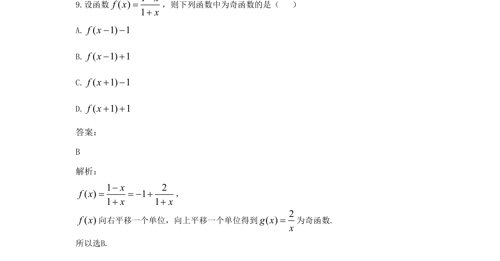

## 题面

## 摘要

本题考查函数平移变换与奇偶性的判断，通过平移将给定函数转化为已知奇函数。

## 关联考点

- [[函数平移变换]]
- [[284-函数的奇偶性|函数的奇偶性]]
- [[284-函数的奇偶性|奇函数]]

## 答案与解析

> 📄 原 PDF 第 5 页：`素材/真题/吉林/2008-2024·（吉林）数学高考真题/2021年高考数学试卷（文）（全国乙卷）（新课标Ⅰ）（解析卷）.pdf`
