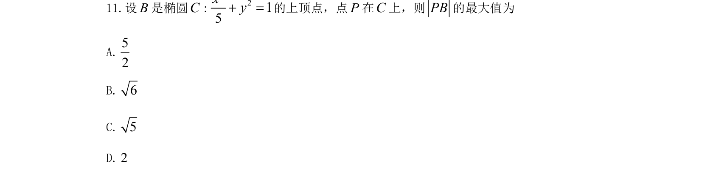
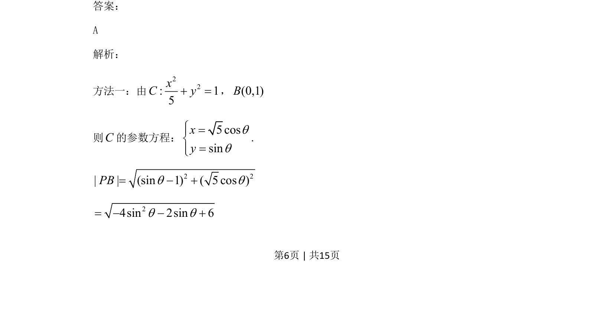
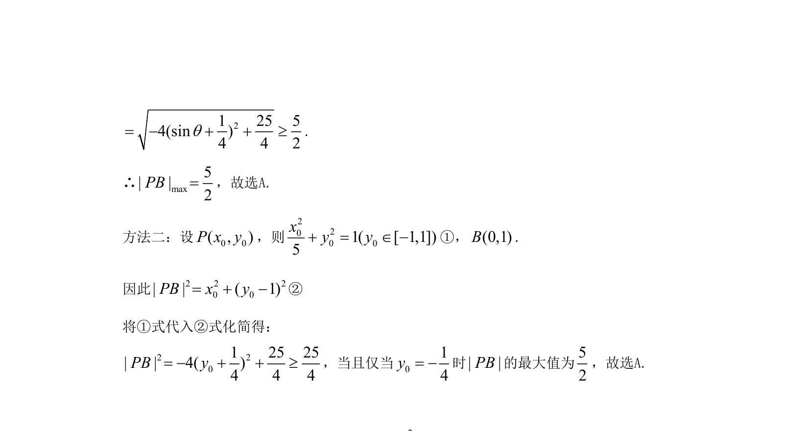

## 题面

## 摘要

考查椭圆上动点到定点距离的最值问题，通过参数方程转化为二次函数求最大值。

## 关联考点

- [[939-椭圆参数方程|椭圆参数方程]]
- [[626-两点间距离公式|两点间距离公式]]
- [[640-二次函数最值|二次函数最值]]

## 答案与解析

> 📄 原 PDF 第 6 页：`素材/真题/吉林/2008-2024·（吉林）数学高考真题/2021年高考数学试卷（文）（全国乙卷）（新课标Ⅰ）（解析卷）.pdf`
