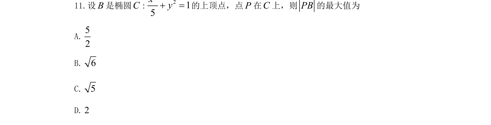
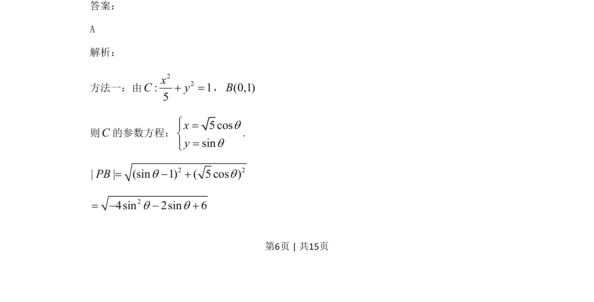
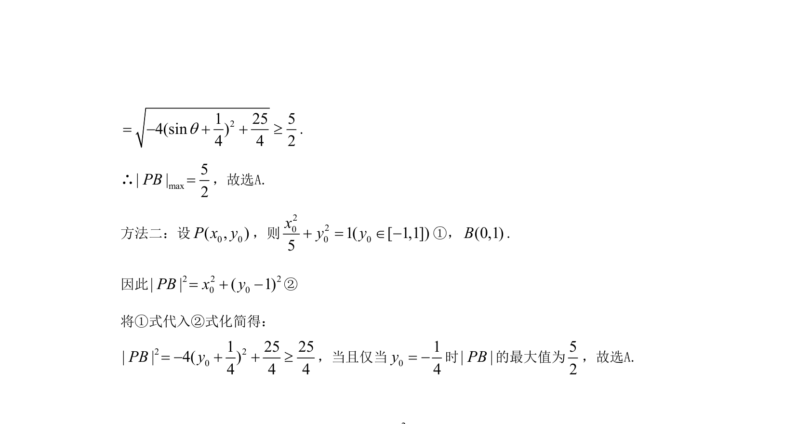

## 题面

## 摘要

考查椭圆上动点到定点距离的最值问题，通过参数方程转化为二次函数求最大值。

## 关联考点

- [[565-椭圆的参数方程|椭圆参数方程]]
- [[626-两点间距离公式|两点间距离公式]]
- [[640-二次函数最值|二次函数最值]]

## 答案与解析

> 📄 原 PDF 第 6 页：`素材/真题/吉林/2008-2024·（吉林）数学高考真题/2021年高考数学试卷（文）（全国乙卷）（新课标Ⅰ）（解析卷）.pdf`

<!-- 题干文本-start -->
## 题干文本
11.设B是椭圆C:
2215xy+ =的上顶点，点P在C上，则PB的最大值为
A.52
B.6
C.5
D.2
答案：
A
解析：
方法一：由
22: 15xC y+ =，(0,1)B
则C的参数方程：5 cossinxyqq==
.
2 2| | (sin 1) ( 5 cos )PBq q= - +24sin 2sin 6q q= - - +
<!-- 题干文本-end -->

<!-- 解析文本-start -->
## 解析文本

<!-- 解析文本-end -->
