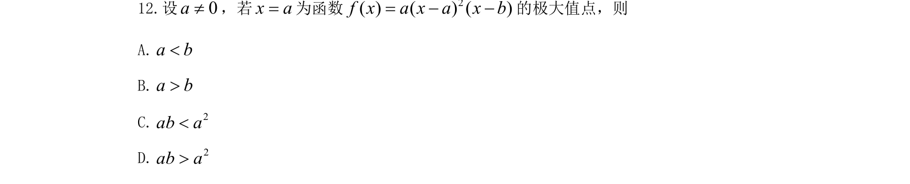
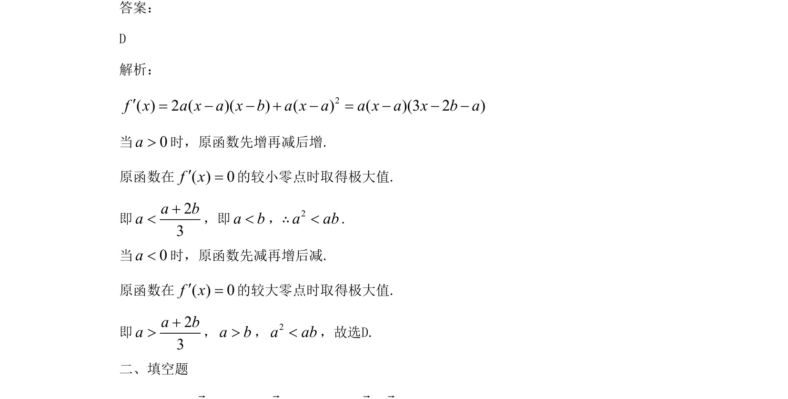

## 题面

## 摘要

该题考查含参三次函数的极值点条件，通过求导与分类讨论确定参数关系。

## 关联考点

- [[548-导数与极值|导数与极值]]
- [[600-三次函数|三次函数]]
- [[424-参数分类讨论|分类讨论]]

## 答案与解析

> 📄 原 PDF 第 7 页：`素材/真题/吉林/2008-2024·（吉林）数学高考真题/2021年高考数学试卷（文）（全国乙卷）（新课标Ⅰ）（解析卷）.pdf`
